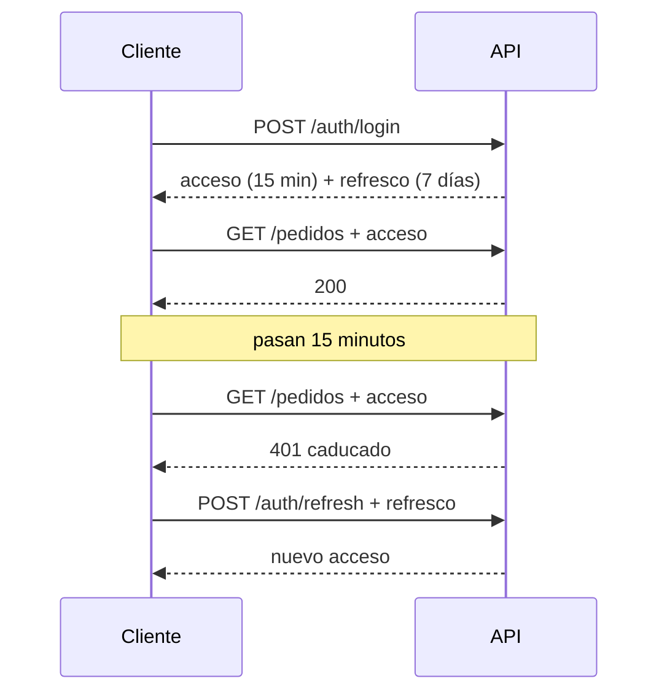
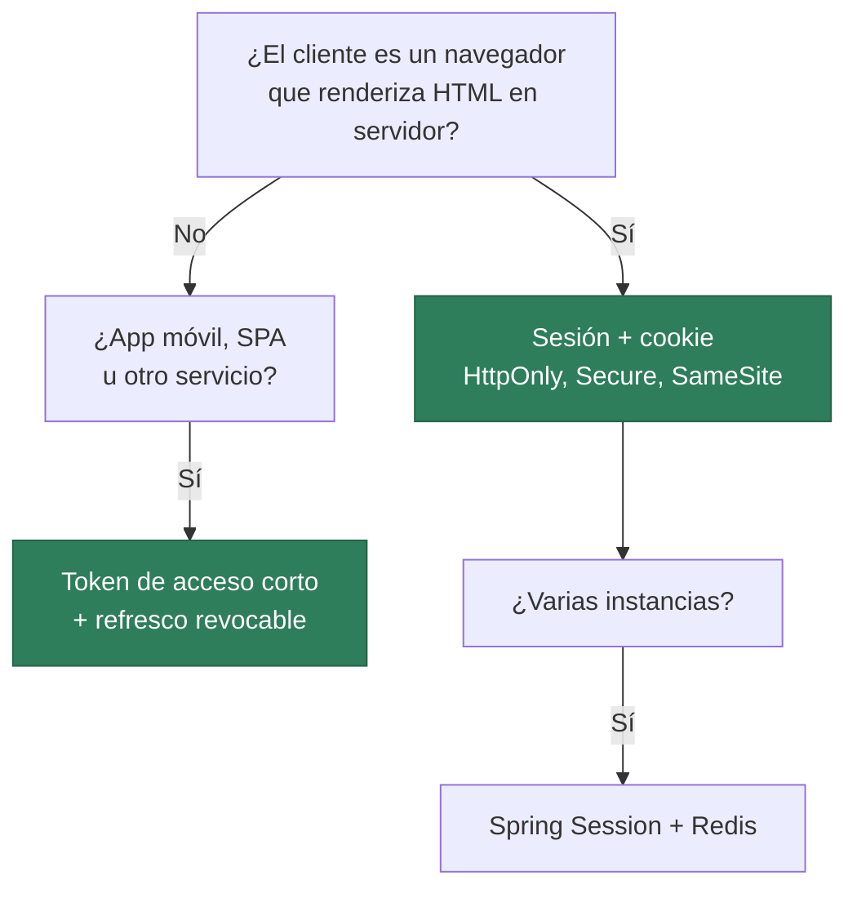

# Sesión o token: elegir con criterio

> Ya sabes montar las dos. Esta página es la que separa a quien copia una configuración de quien decide una arquitectura.

## 1. La comparación honesta

!!! analogia "Analogía"
    La **sesión** es el guardarropa de un teatro: te dan un número y toda tu información se queda dentro, en el local. Si vas a otra sede, tu número no vale nada. El **token** es la entrada impresa: lleva encima quién eres, hasta cuándo vale y un sello que no se puede falsificar, así que **cualquier puerta** puede validarla sin llamar por teléfono a nadie.

| | Sesión de servidor | Token (JWT) |
|---|---|---|
| Dónde vive el estado | En el servidor | En el cliente |
| Qué viaja | Un identificador opaco | Los datos, firmados y legibles |
| Escalado horizontal | Necesita sesión compartida o *sticky* | Trivial |
| **Revocación inmediata** | :material-check: Se borra la sesión | :material-close: Vale hasta que caduca |
| Tamaño por petición | ~30 bytes | ~500-1000 bytes |
| Clientes no navegador | Incómodo | Natural |
| CSRF | Vulnerable: hay que protegerse | No aplica si no va en cookie |
| XSS | `HttpOnly` protege la cookie | En `localStorage` queda expuesto |

La fila que más se olvida es la de **revocación**. Con sesión, expulsar a un usuario es borrar una entrada. Con JWT, ese token sigue siendo válido hasta que expire, y no hay forma de invalidarlo sin renunciar a la ventaja de no consultar nada.

## 2. Cómo se resuelve en la práctica

**Token de acceso corto + token de refresco revocable.** El de acceso vive 15 minutos y no se revoca —da igual, caduca enseguida—. El de refresco vive días, se guarda en el servidor y **sí** se puede anular.



Expulsar a alguien = borrar su token de refresco. Como mucho sigue dentro 15 minutos.

```java
@PostMapping("/auth/refresh")
public LoginRespuesta refrescar(@RequestBody Map<String, String> cuerpo) {
    var refresco = cuerpo.get("refreshToken");
    var guardado = refrescoRepositorio.buscar(refresco)
            .orElseThrow(() -> new CredencialesInvalidasException("Token de refresco no válido"));
    if (guardado.caducado()) {
        refrescoRepositorio.borrar(refresco);
        throw new CredencialesInvalidasException("Sesión expirada");
    }
    var usuario = uds.loadUserByUsername(guardado.username());
    return new LoginRespuesta(jwt.generar(usuario), "Bearer", 900);
}
```

## 3. La regla práctica



En este módulo lo verás de las dos formas: **token** en la API de la UT6, y **sesión** cuando en la UT8 el login sea un formulario de Thymeleaf. La misma aplicación puede tener las dos: sesión para las páginas y token para la API que consume el móvil.

## 4. La lista que no puede faltar

Antes de dar por buena cualquier autenticación:

- [ ] **HTTPS** siempre. Sin él, todo lo demás sobra.
- [ ] Contraseñas con **BCrypt o Argon2**, nunca SHA-256 ni cifradas.
- [ ] Token de acceso **corto** y refresco **revocable**.
- [ ] Secreto en **variable de entorno**, jamás en el repositorio.
- [ ] Cookie de sesión con `HttpOnly`, `Secure` y `SameSite`.
- [ ] Mensaje de error **genérico** en el login: nunca «ese usuario no existe».
- [ ] **Rate limiting** en el login (429) contra la fuerza bruta.
- [ ] Sin datos sensibles en el JWT ni en los logs.
- [ ] Cerrado por defecto: `.anyRequest().authenticated()` al final.

---

## Pruébalo ahora (25 min)

!!! reto "Trabaja tú ahora"
    Este bloque se hace **en clase, en tu equipo**. No se entrega ni puntúa: es la práctica que hace que el examen te salga.

**Parte 1.** Añade `POST /auth/refresh` con tokens de refresco guardados en memoria, y pon el de acceso a 60 segundos. Comprueba el ciclo completo: login → llamada OK → esperar → 401 → refresh → llamada OK.

**Parte 2 — Revoca.** Borra el token de refresco del almacén y comprueba que `refresh` devuelve 401 mientras el de acceso sigue funcionando hasta caducar. **Ese hueco de 60 segundos es la limitación real de JWT**, y ahora la has visto.

**Parte 3 — Las dos a la vez.** Deja la API con token y añade un `POST /login-web` que use sesión. Comprueba con dos *cookie jars* que conviven sin estorbarse.

---

## Ejercicios (con solución)

### Ejercicio 1 — Elige
(a) intranet con páginas en servidor · (b) app móvil · (c) API pública para terceros · (d) panel de administración de un banco · (e) microservicio que llama a otro.

??? success "Solución"

    (a) <b>sesión</b>: es un navegador con HTML de servidor · (b) <b>token</b> con refresco · (c) <b>token</b>, o claves de API por cliente · (d) <b>sesión</b> con caducidad corta y <code>SameSite=Strict</code>, porque la revocación inmediata es un requisito · (e) <b>token</b> de cliente (OAuth2 <i>client credentials</i>) o mTLS.


### Ejercicio 2 — El despido
Despiden a un empleado a las 10:00 y hay que cortarle el acceso ya. ¿Qué pasa con cada mecanismo?

??? success "Solución"

    Con <b>sesión</b>: se borra su sesión del almacén y a la siguiente petición está fuera. Inmediato.<br>
    Con <b>JWT puro</b>: su token sigue siendo válido hasta que caduque; no hay forma de invalidarlo sin consultar algo en cada petición, que es justo lo que se quería evitar.<br>
    Solución real: acceso corto (15 min) + refresco revocable, y borrar el de refresco. Está fuera en 15 minutos como máximo. Si el requisito es <b>cero segundos</b>, hay que aceptar una lista negra consultada en cada petición y asumir el coste.


### Ejercicio 3 — Los dos ataques
Explica CSRF y XSS y qué mecanismo es vulnerable a cada uno.

??? success "Solución"

    <b>CSRF:</b> una web maliciosa hace que tu navegador envíe una petición a otra web donde estás autenticado; como la <b>cookie viaja sola</b>, la petición va firmada. Afecta a la sesión con cookie; se mitiga con <code>SameSite</code> y con token anti-CSRF. No afecta al token en cabecera, porque el navegador no lo añade solo.<br>
    <b>XSS:</b> el atacante ejecuta JavaScript en tu página. Roba lo que el JS pueda leer: un token en <code>localStorage</code> sí, una cookie <code>HttpOnly</code> no.<br>
    De ahí la conclusión: <b>cada mecanismo es vulnerable a uno de los dos</b>, y por eso la decisión es de diseño, no de moda.

