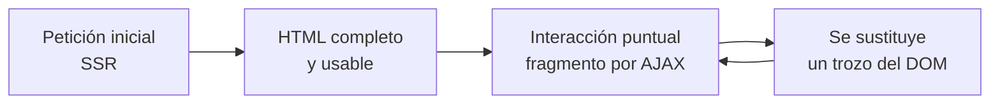

# Servidor o cliente: dónde se ejecuta cada cosa

Llevas siete unidades devolviendo JSON. Ahora vas a devolver **HTML ya montado**. Antes de escribir una sola plantilla hay que tener clarísima una pregunta: *¿quién construye la página, tu servidor o el navegador?*

Porque las dos respuestas son válidas, se usan las dos en la industria, y elegir mal cuesta meses.

## 1. Las dos formas de llegar a la misma pantalla

Imagina una lista de productos. El usuario quiere ver seis filas con nombre y precio. Hay dos caminos.

**Camino A — el servidor monta el HTML** (*Server-Side Rendering*, SSR)

``` { .text .sinajuste }
Navegador ──GET /productos──▶ Servidor
                             consulta la BD
                             mete los datos en una plantilla
                             genera el HTML completo
Navegador ◀──HTML listo───── Servidor
El navegador lo pinta. Fin.
```

**Camino B — el navegador monta el HTML** (*Client-Side Rendering*, CSR)

``` { .text .sinajuste }
Navegador ──GET /────────────▶ Servidor
Navegador ◀──HTML vacío + JS── Servidor
El navegador ejecuta el JS
Navegador ──GET /api/productos▶ Servidor
Navegador ◀──JSON───────────── Servidor
El JS construye el HTML y lo inserta. Fin.
```

Fíjate en lo importante: **en el camino B el servidor sigue haciendo exactamente lo que hacías en la UT6**. La API REST no desaparece. Lo que cambia es quién ensambla la pantalla.

!!! note "Esta unidad va del camino A"
    El RA8 pide *«generar páginas web con guiones embebidos en el servidor»*. Eso es SSR. Pero no se enseña como si el camino B no existiera: lo profesional es saber cuándo usar cada uno, y a partir del tema 5 vas a mezclarlos.

## 2. Qué hace bien cada uno

| | Servidor (SSR) | Cliente (CSR) |
|---|---|---|
| Primera pantalla | **Rápida**: llega HTML pintable | Lenta: hay que descargar y ejecutar JS antes de ver nada |
| Buscadores | **Ven el contenido** directamente | Necesitan ejecutar JS; funciona, pero peor |
| Interacción fina (arrastrar, filtrar en vivo) | Torpe: cada cambio es una petición | **Natural** |
| Carga en el servidor | Alta: renderiza cada petición | Baja: solo sirve JSON |
| Conexión mala o móvil viejo | **Aguanta bien** | Sufre |
| Complejidad del proyecto | Baja: un solo despliegue | Alta: dos proyectos, dos despliegues |

La regla práctica que usa la industria: **cuanto más "documento" es tu pantalla, más SSR; cuanto más "aplicación", más CSR.** Un blog, una tienda o un panel de administración interno son documentos. Un editor de vídeo o un Figma son aplicaciones.

!!! tip "El criterio del examen"
    Si te preguntan *«¿SSR o CSR para X?»*, la respuesta nunca es «SSR porque sí». Se espera que menciones **tiempo de primera pantalla, indexación y grado de interactividad**, y que decidas con eso.

## 3. Por qué unir las dos

Durante unos años esto se vivió como una guerra de bandos. Se acabó, y acabó en tablas: **hoy casi todo lo serio es híbrido**.

La página llega montada desde el servidor —rápida, indexable, funciona sin JavaScript— y encima se añade interactividad puntual: un buscador que filtra sin recargar, un botón que borra una fila, un contador que se actualiza solo.



Es exactamente lo que vas a construir en esta unidad: los temas 2 a 4 montan el SSR, y el tema 5 le añade la parte dinámica **sin escribir una SPA entera**.

Esto no es una simplificación para clase. Es la razón de que hayan aparecido Next.js con sus *server components*, Remix, Hotwire en Rails, Livewire en Laravel y htmx en cualquier sitio. Todos vuelven a lo mismo: **HTML desde el servidor, con retoques**.

## 4. Dónde encaja Thymeleaf

Un **motor de plantillas** es un programa que coge un fichero con huecos y un mapa de datos, y devuelve texto relleno.

```
plantilla.html  +  { nombre: "Ana", saldo: 42.50 }  ──▶  HTML final
```

En el mundo Java has visto o verás varios nombres:

| Motor | Estado en 2026 |
|---|---|
| **JSP** | Legado. Mezcla Java dentro del HTML. No se usa en proyectos nuevos |
| **Thymeleaf** | **El estándar de facto en Spring Boot**. El que usaremos |
| **FreeMarker**, **Mustache** | Vivos, minoritarios en web; frecuentes para generar correos |
| **JTE**, **Rocker** | Modernos, compilados, muy rápidos. Nicho creciente |

La gracia de Thymeleaf frente a JSP es el **prototipado natural**: una plantilla de Thymeleaf es HTML válido. Si la abres directamente con doble clic en el navegador, se ve —con datos de mentira, pero se ve—. Un JSP abierto así es un churro de etiquetas.

```html
<!-- Thymeleaf: esto es HTML válido y además una plantilla -->
<td th:text="${producto.nombre}">Teclado mecánico</td>
```

Abierto a pelo muestra *«Teclado mecánico»*. Renderizado por el servidor, muestra el nombre real. El diseñador puede trabajar con el fichero sin arrancar nada.

## 5. Lo que NO cambia de todo lo que sabes

Este es el punto que más tranquiliza y más se olvida: **el servicio y el repositorio no se tocan**.

```java
@Controller                                    // ← no @RestController
@RequestMapping("/productos")
public class ProductoVistaControlador {

    private final ProductoServicio servicio;   // ← el mismo de la UT4

    @GetMapping
    public String listar(Model modelo) {
        modelo.addAttribute("productos", servicio.listar());
        return "productos/lista";              // ← nombre de la plantilla
    }
}
```

Tres diferencias con lo que llevas haciendo, y ninguna más:

1. `@Controller` en vez de `@RestController`.
2. Se recibe un `Model`, que es un mapa de datos para la vista.
3. Se devuelve un **`String` con el nombre de la plantilla**, no un objeto.

!!! danger "El error número uno de la unidad"
    Poner `@RestController` en un controlador de vistas. Spring interpreta el `return "productos/lista"` como *«devuelve el texto plano productos/lista»* y el navegador muestra esa cadena tal cual, sin HTML.

    Cuando veas en pantalla el nombre de tu plantilla escrito como texto, ya sabes qué anotación mirar.

Y al revés: en el mismo proyecto puedes tener `ProductoControlador` (`@RestController`, `/api/v1/productos`, devuelve JSON) y `ProductoVistaControlador` (`@Controller`, `/productos`, devuelve HTML), **apoyados en el mismo servicio**. Esa es la arquitectura que montaste en la UT4 pagando dividendos otra vez.

## 6. Qué se ejecuta dónde: el resumen que hay que memorizar

| Se ejecuta en el **servidor** | Se ejecuta en el **cliente** |
|---|---|
| Java, Spring, tu servicio | JavaScript |
| Las expresiones `${...}` de Thymeleaf | Las validaciones visuales instantáneas |
| El acceso a la base de datos | La animación del menú desplegable |
| **Las comprobaciones de seguridad** | Nada de seguridad, jamás |

La última fila es la más importante de la unidad. Todo lo que se ejecuta en el cliente **el usuario lo puede desactivar, editar o saltarse** con las herramientas de desarrollo del navegador.

Una validación en JavaScript sirve para que el usuario no pierda el tiempo; **no sirve para proteger nada**. En el tema 4 verás que el formulario se valida en el navegador *y otra vez* en el servidor, y que la segunda es la única que cuenta.

## Pruébalo ahora (10 min)

!!! reto "Trabaja tú ahora"
    Este bloque se hace **en clase, en tu equipo**. No se entrega ni puntúa: es la práctica que hace que el examen te salga.

Levanta cualquier proyecto de la UT4 y añade este controlador. Son dos rutas que devuelven **lo mismo** por los dos caminos:

``` { .java .numerado title="ComparaController.java" }
@Controller
public class ComparaController {

    private final List<String> frutas = List.of("Manzana", "Pera", "Kiwi");

    @GetMapping("/ssr")                    // servidor: devuelve HTML
    public String ssr(Model modelo) {
        modelo.addAttribute("frutas", frutas);
        return "frutas";
    }

    @GetMapping("/api/frutas")             // cliente: devuelve datos
    @ResponseBody
    public List<String> api() {
        return frutas;
    }
}
```

```html title="src/main/resources/templates/frutas.html"
<!DOCTYPE html>
<html xmlns:th="http://www.thymeleaf.org">
<body>
    <ul><li th:each="f : ${frutas}" th:text="${f}">Fruta</li></ul>
</body>
</html>
```

Ahora **mira las dos con el navegador y con `curl`**:

```bash
curl -s http://localhost:8080/ssr          # sale <li>Manzana</li>...
curl -s http://localhost:8080/api/frutas   # sale ["Manzana","Pera","Kiwi"]
```

Y lo importante: en el navegador, botón derecho → **Ver código fuente** en `/ssr`. Las frutas están ahí, en el HTML que llegó por la red. Eso es lo que ve Google, y lo que no vería si las pintara JavaScript.

---

## Ejercicios (con solución)

### Ejercicio 1 — SSR y CSR sin siglas

Explica en dos frases la diferencia entre las dos formas de construir una página, sin usar las siglas.

??? success "Solución"

    En una, **el servidor manda la página ya hecha**: el navegador recibe HTML con los datos dentro y solo tiene que pintarlo.

    En la otra, **el servidor manda una página vacía y los datos por separado**: es el navegador quien, ejecutando JavaScript, construye el HTML a partir de esos datos.

    La prueba está en «Ver código fuente»: en la primera se ven los datos, en la segunda se ve un `<div id="app"></div>` y poco más.

### Ejercicio 2 — El catálogo de la biblioteca

Un catálogo público de una biblioteca municipal, que cualquiera puede consultar sin registrarse. ¿Servidor, cliente o mezcla? Justifícalo con **dos** argumentos.

??? success "Solución"

    **En el servidor.** Dos razones:

    1. **Buscadores.** Es contenido público que interesa que aparezca en Google. Un buscador indexa lo que viene en el HTML; si los libros los pinta JavaScript, puede que no los vea.
    2. **Equipos modestos.** Los usuarios de un catálogo municipal entran desde móviles viejos y ordenadores públicos. Renderizar en el servidor descarga trabajo del cliente y la primera pantalla llega antes.

    Un tercer motivo: es una web de leer, no una aplicación. No hay estado complejo que justifique el coste de una aplicación de cliente.

    **Mezcla** solo en detalles: el buscador con sugerencias mientras escribes, que es justo el caso del tema 5.

### Ejercicio 3 — La anotación equivocada

¿Qué anotación lleva un controlador que devuelve HTML? ¿Y qué ocurre exactamente si te equivocas de anotación?

??? success "Solución"

    Lleva **`@Controller`**, a secas.

    Si pones `@RestController` —o si añades `@ResponseBody` a un método—, Spring deja de interpretar la cadena que devuelves como el nombre de una plantilla y **la escribe tal cual en la respuesta**. En el navegador ves la palabra `productos/lista` en texto plano, sin HTML y sin error.

    Es un fallo que despista mucho porque **no lanza ninguna excepción**: la aplicación responde 200 y parece que funciona.

### Ejercicio 4 — HTML válido

¿Por qué se dice que una plantilla de Thymeleaf es «HTML válido» y una JSP no?

??? success "Solución"

    Thymeleaf mete su lógica en **atributos** de etiquetas HTML normales:

    ```html
    <h1 th:text="${titulo}">Título de ejemplo</h1>
    ```

    Un navegador que no sepa qué es `th:text` **ignora el atributo** y pinta «Título de ejemplo». El fichero se puede abrir con doble clic, sin servidor, y se ve la maqueta.

    Una JSP mete etiquetas y código que no son HTML (`<c:forEach>`, `<%= %>`), así que el fichero solo tiene sentido después de pasar por el servidor.

    Esto no es cosmético: significa que **un diseñador puede maquetar y un programador rellenar**, sobre el mismo fichero, sin pisarse.

### Ejercicio 5 — «Ya lo valido con JavaScript»

Un compañero valida el DNI con JavaScript en el navegador y dice que el formulario ya está protegido. ¿Qué le respondes, y cómo se lo demuestras?

??? success "Solución"

    Que **la validación del navegador es comodidad, no seguridad**. Sirve para avisar al usuario sin ir al servidor, y desaparece en cuanto alguien no usa el navegador.

    La demostración, en una línea:

    ```bash
    curl -X POST http://localhost:8080/socios -d "dni=BASURA&nombre=X"
    ```

    Ahí no hay JavaScript que valga. Si el servidor lo acepta, el dato malo entra en la base de datos.

    **Toda validación se repite en el servidor.** La del cliente es la primera puerta; la del servidor es la que cierra.

### Ejercicio 6 — ¿Dónde se ejecuta?

Di, para cada una, si ocurre en el servidor o en el navegador:

(a) `th:each` · (b) un `onclick` · (c) la consulta a la base de datos · (d) `@{/productos}` · (e) `fetch('/api/productos')` · (f) comprobar que el usuario tiene el rol ADMIN

??? success "Solución"

    | | Dónde | Por qué |
    |---|---|---|
    | (a) `th:each` | **Servidor** | Cuando el HTML sale por la red, el bucle ya se ha desplegado en filas |
    | (b) `onclick` | **Navegador** | Es JavaScript; el servidor solo lo escribió como texto |
    | (c) la consulta | **Servidor** | El navegador nunca habla con la base de datos |
    | (d) `@{/productos}` | **Servidor** | Se convierte en un `href` normal antes de enviarse |
    | (e) `fetch(...)` | **Navegador**, y provoca una petición nueva al servidor | Las dos cosas: se ejecuta en el cliente y acaba en el servidor |
    | (f) el rol ADMIN | **Servidor**, siempre | Si lo decide el cliente, lo decide el atacante |

    La regla para no equivocarse: **todo lo que lleva `th:` se ha terminado antes de que la página salga del servidor.**
