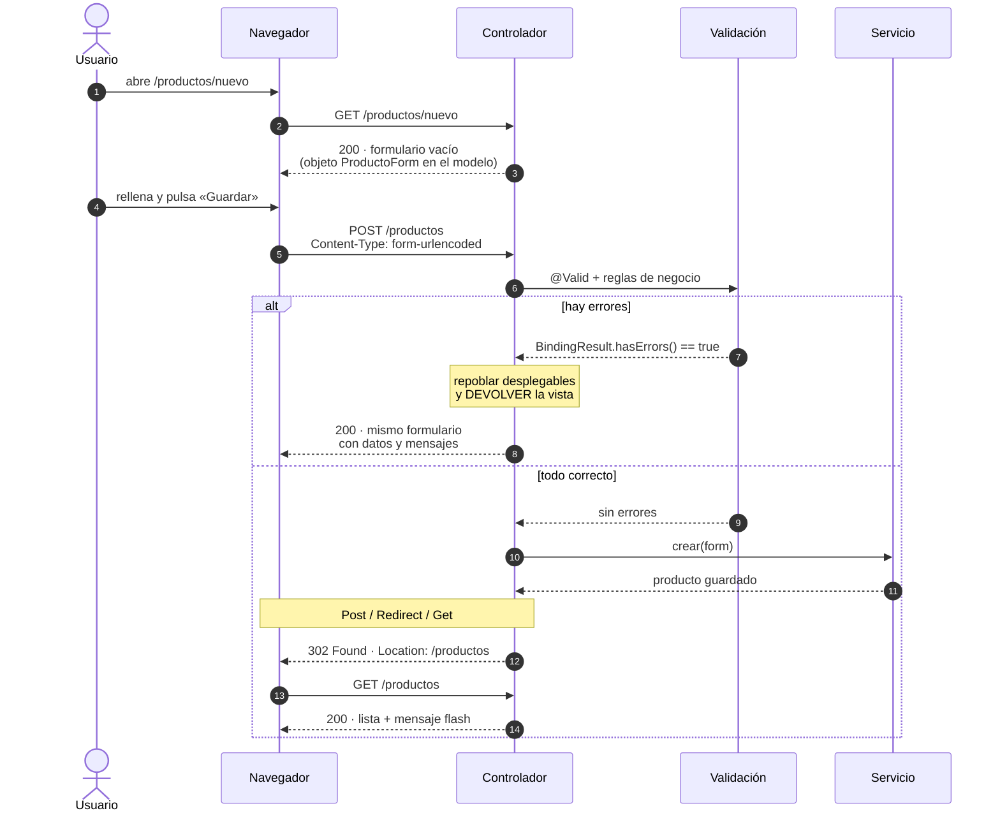

# Formularios y validación

Este es **el tema central del RA8**. El criterio de evaluación lo dice literalmente: *«generar páginas web que incluyan verificación de formularios»*. Y es también donde más nota se pierde, porque un formulario que parece funcionar puede estar mal en cinco sitios distintos.

## 1. El ciclo completo de un formulario



Fíjate en la rama de éxito: **no se responde con HTML, se responde con una redirección**. Eso tiene nombre y hay que sabérselo (§6).

## 2. El objeto de formulario

No se ata el formulario a la entidad. Se usa un objeto propio, igual que los DTO de la UT4:

```java
public class ProductoForm {

    @NotBlank(message = "El nombre es obligatorio")
    @Size(min = 2, max = 80, message = "Entre 2 y 80 caracteres")
    private String nombre;

    @NotNull(message = "El precio es obligatorio")
    @DecimalMin(value = "0.01", message = "Debe ser mayor que cero")
    @Digits(integer = 8, fraction = 2)
    private BigDecimal precio;

    @NotNull
    private Categoria categoria;

    @Min(value = 0, message = "El stock no puede ser negativo")
    private int stock;

    // getters y setters: Thymeleaf los necesita para el binding
}
```

!!! danger "Aquí NO valen los `record`"
    Un `record` es inmutable y no tiene *setters*. El enlace de datos de Spring necesita crear el objeto vacío y rellenarlo campo a campo.

    Es el mismo motivo por el que una entidad JPA tampoco puede ser un `record` (UT5 tema 2), pero por un mecanismo distinto: aquí es el *data binding*, allí era el proveedor de persistencia. Se pregunta en el examen.

**Y no se usa la entidad como objeto de formulario.** Si lo haces, cualquiera puede añadir un campo oculto al HTML —o directamente enviar un POST con `curl`— y escribir en propiedades que no pusiste en el formulario: el `id`, el `rol`, el `descuento`. Eso es *mass assignment*, y lo penalizamos desde la UT4.

## 3. Pintar el formulario

```java
@GetMapping("/nuevo")
public String nuevo(Model modelo) {
    modelo.addAttribute("producto", new ProductoForm());
    modelo.addAttribute("categorias", Categoria.values());
    return "productos/formulario";
}
```

``` { .html .numerado .annotate title="templates/productos/formulario.html" hl_lines="1 4 14" }
<form th:action="@{/productos}" th:object="${producto}" method="post">   <!-- (1)! -->

    <label for="nombre">Nombre</label>
    <input type="text" id="nombre" th:field="*{nombre}"                  <!-- (2)! -->
           th:classappend="${#fields.hasErrors('nombre')} ? 'error'">    <!-- (3)! -->
    <p class="msg-error" th:if="${#fields.hasErrors('nombre')}"
       th:errors="*{nombre}">Error</p>                                   <!-- (4)! -->

    <label for="precio">Precio (€)</label>
    <input type="number" step="0.01" id="precio" th:field="*{precio}">
    <p class="msg-error" th:errors="*{precio}" th:if="${#fields.hasErrors('precio')}"></p>

    <label for="categoria">Categoría</label>
    <select id="categoria" th:field="*{categoria}">                      <!-- (5)! -->
        <option value="">— elige —</option>
        <option th:each="c : ${categorias}" th:value="${c}" th:text="${c}">MOVILIDAD</option>
    </select>

    <button type="submit">Guardar</button>
</form>
```

1.  **Dos cosas en una línea.** `@{/productos}` es una URL *de contexto*: si mañana la aplicación se despliega en `/tienda`, Thymeleaf escribe `/tienda/productos` solo. Escribir `/productos` a pelo funciona en tu portátil y se rompe al desplegar. Y `th:object` fija el objeto del formulario: a partir de aquí se usa `*{campo}` en vez de `${producto.campo}`.

2.  **`th:field` es el atajo que lo hace todo**: genera `id`, `name` **y** `value` de una sola vez, y en un `select` marca la opción seleccionada. Escribir esos tres atributos a mano es la vía rápida a que el formulario «no recuerde» lo que el usuario había escrito al volver con errores.

3.  **`th:classappend` añade una clase sin borrar las que ya hay.** Con `th:class` machacarías el atributo entero y perderías el estilo original del campo.

4.  **`th:errors` pinta los mensajes de *ese* campo.** El texto «Error» que hay dentro de la etiqueta es un *prototipo*: se ve al abrir el HTML directamente en el navegador y Thymeleaf lo sustituye al renderizar. Es la gracia de Thymeleaf frente a otros motores — la plantilla sigue siendo un HTML válido que un diseñador puede abrir.

5.  **En un `select`, `th:field` también decide qué `option` sale marcada.** Por eso el controlador tiene que volver a meter `categorias` en el modelo cuando hay errores: sin la lista, este bucle no pinta nada y el desplegable sale vacío.

Para los errores que no son de un campo concreto —«ese código ya existe»— hay un canal aparte:

```html
<div class="alerta" th:if="${#fields.hasGlobalErrors()}">
    <p th:each="e : ${#fields.globalErrors()}" th:text="${e}"></p>
</div>
```

## 4. Recibirlo y validarlo

Este método concentra **cuatro decisiones** que se fallan cada curso. Pincha en los números.

``` { .java .annotate title="ProductoController.java" hl_lines="2 3" }
@PostMapping
public String crear(@Valid @ModelAttribute("producto") ProductoForm form,  // (1)!
                    BindingResult errores,                                 // (2)!
                    Model modelo,
                    RedirectAttributes flash) {

    if (servicio.existeNombre(form.getNombre())) {
        errores.rejectValue("nombre", "duplicado",
                            "Ya existe un producto con ese nombre");        // (3)!
    }

    if (errores.hasErrors()) {
        modelo.addAttribute("categorias", Categoria.values());              // (4)!
        return "productos/formulario";                                      // (5)!
    }

    servicio.crear(form);
    flash.addFlashAttribute("exito", "Producto creado correctamente");      // (6)!
    return "redirect:/productos";
}
```

1.  **El nombre explícito importa.** Si escribes solo `@ModelAttribute`, Spring usa el nombre de la clase en minúscula (`productoForm`) y tu `th:object="${producto}"` en la plantilla no lo encuentra: el formulario se pinta vacío sin dar ningún error.

2.  **`BindingResult` va INMEDIATAMENTE después del objeto validado.** Es la línea más importante del método. Ver el aviso rojo de abajo.

3.  **Validación de negocio, la que las anotaciones no pueden hacer.** «Que no se repita el nombre» exige consultar la base de datos, así que no cabe en un `@NotBlank`. `rejectValue` la mete en el mismo saco de errores que las demás, y la plantilla la pinta igual que el resto.

4.  **Repoblar las listas.** Al volver al formulario, el modelo se ha reconstruido desde cero: si no vuelves a añadir `categorias`, el desplegable sale vacío y el alumno cree que ha roto Thymeleaf.

5.  **Devolver la vista, no redirigir.** Una redirección aquí perdería los errores y lo que el usuario había escrito. Solo se redirige cuando la operación ha ido bien (ver PRG, apartado 6).

6.  **Flash attribute**, no `Model`: sobrevive exactamente a **una** redirección y luego desaparece. Si usaras `Model`, el mensaje no llegaría al `GET` siguiente.

!!! danger "`BindingResult` va INMEDIATAMENTE después del objeto validado"
    Si metes cualquier parámetro entre `@Valid ProductoForm form` y `BindingResult errores`, Spring deja de asociarlos y **lanza una excepción en vez de recoger los errores**. El formulario acaba en una página de error 400 en lugar de mostrar los mensajes.

    Compila perfectamente. Falla solo en ejecución. Cae todos los años.

## 5. Las dos validaciones, y cuál cuenta

```html
<input type="text" th:field="*{nombre}" required minlength="2" maxlength="80">
<input type="number" th:field="*{precio}" required min="0.01" step="0.01">
<input type="email" th:field="*{correo}" required>
```

Los atributos HTML dan **respuesta inmediata sin ir al servidor**: mejor experiencia, menos peticiones. Perfecto.

Y no protegen absolutamente nada. Se saltan borrando el atributo desde el inspector, o enviando el POST con `curl`:

```bash
curl -X POST localhost:8080/productos -d "nombre=&precio=-5"
```

**La validación del servidor es la única que cuenta.** La del navegador es cortesía. En el examen, un formulario que solo valida en HTML tiene el criterio de validación a cero, aunque en el navegador se comporte de maravilla.

!!! tip "Cómo demostrarlo en clase en un minuto"
    Abre el inspector, borra el `required` de un campo, envía. Si la aplicación guarda un producto sin nombre, ya está demostrado. Es una demostración que se recuerda mejor que tres párrafos.

## 6. Post-Redirect-Get: por qué la redirección

Después de guardar, **nunca** devuelvas HTML directamente. Redirige.

Si respondes con la página de resultado, la URL del navegador sigue siendo el `POST`. El usuario pulsa F5, el navegador pregunta *«¿reenviar el formulario?»*, el usuario dice que sí, y acabas de crear el producto dos veces.

```java
return "redirect:/productos";     // BIEN el navegador hace un GET limpio
return "productos/lista";         // MAL  F5 duplica el envío
```

Ese patrón se llama **Post-Redirect-Get (PRG)** y es obligatorio en la rúbrica.

El problema evidente es que al redirigir se pierde el modelo. Para eso están los *flash attributes*, que sobreviven exactamente a una redirección:

```java
flash.addFlashAttribute("exito", "Producto creado correctamente");
```

```html title="fragmentos/ui.html"
<div th:fragment="mensajes">
    <div class="alerta-ok"    th:if="${exito}"  th:text="${exito}"></div>
    <div class="alerta-error" th:if="${error}"  th:text="${error}"></div>
</div>
```

## 7. Editar: el mismo formulario, otra ruta

```java
@GetMapping("/{id}/editar")
public String editar(@PathVariable Long id, Model modelo) {
    modelo.addAttribute("producto", servicio.aFormulario(id));
    modelo.addAttribute("categorias", Categoria.values());
    return "productos/formulario";
}

@PostMapping("/{id}")
public String actualizar(@PathVariable Long id,
                         @Valid @ModelAttribute("producto") ProductoForm form,
                         BindingResult errores, Model modelo, RedirectAttributes flash) { … }
```

Y la plantilla decide su destino sola:

```html
<form th:action="${producto.id} != null ? @{/productos/{id}(id=${producto.id})} : @{/productos}"
      th:object="${producto}" method="post">
```

**El borrado necesita un `POST`**, nunca un enlace:

```html
<form th:action="@{/productos/{id}/borrar(id=${p.id})}" method="post"
      onsubmit="return confirm('¿Seguro?')">
    <button type="submit">Borrar</button>
</form>
```

Un `<a href="/productos/5/borrar">` es un `GET`, y los `GET` deben ser seguros: el precargador del navegador, un rastreador o el propio historial pueden dispararlo. Es el mismo principio de idempotencia que estudiaste en la UT1 y aplicaste en la UT6.

## 8. CSRF: por qué tus formularios ya lo llevan

Si tienes Spring Security en el proyecto —y lo tienes desde la UT7—, la protección CSRF está activa por defecto. Thymeleaf **inserta el token automáticamente** en cualquier `<form method="post">` que use `th:action`:

```html
<input type="hidden" name="_csrf" value="8f3a...">
```

De ahí una consecuencia práctica: si escribes `action="/productos"` en vez de `th:action="@{/productos}"`, el token no se inyecta y **todos tus POST devuelven 403**. Es una de las causas más frecuentes de «no me funciona el formulario y no entiendo por qué».

El ataque que previene: una página maliciosa que contiene un formulario oculto apuntando a tu aplicación. Como el navegador de la víctima envía sus cookies de sesión automáticamente, la petición llegaría autenticada. El token —que el atacante no puede leer por la política del mismo origen— rompe el ataque.

## Pruébalo ahora (20 min)

!!! reto "Trabaja tú ahora"
    Este bloque se hace **en clase, en tu equipo**. No se entrega ni puntúa: es la práctica que hace que el examen te salga.

El formulario entero, de una pieza. Móntalo y **rómpelo a propósito** con las cuatro pruebas del final.

``` { .java .numerado title="ContactoForm.java" }
public class ContactoForm {

    @NotBlank(message = "El nombre es obligatorio")
    @Size(min = 2, max = 60, message = "Entre 2 y 60 caracteres")
    private String nombre;

    @NotBlank(message = "El correo es obligatorio")
    @Email(message = "No parece un correo válido")
    private String correo;

    @NotNull(message = "Elige un asunto")
    private String asunto;

    @Size(max = 500, message = "Máximo 500 caracteres")
    private String mensaje;

    // getters y setters
}
```

``` { .java .numerado title="ContactoController.java" }
@Controller
@RequestMapping("/contacto")
public class ContactoController {

    private static final List<String> ASUNTOS =
        List.of("Consulta", "Incidencia", "Sugerencia");

    @GetMapping
    public String formulario(Model modelo) {
        modelo.addAttribute("contacto", new ContactoForm());
        modelo.addAttribute("asuntos", ASUNTOS);
        return "contacto";
    }

    @PostMapping
    public String enviar(@Valid @ModelAttribute("contacto") ContactoForm form,
                         BindingResult errores,
                         Model modelo,
                         RedirectAttributes flash) {

        if (form.getCorreo() != null && form.getCorreo().endsWith("@example.com")) {
            errores.rejectValue("correo", "dominio", "Ese dominio no se admite");
        }

        if (errores.hasErrors()) {
            modelo.addAttribute("asuntos", ASUNTOS);   // repoblar SIEMPRE
            return "contacto";
        }

        flash.addFlashAttribute("exito", "Mensaje enviado. Gracias.");
        return "redirect:/contacto";
    }
}
```

``` { .html .numerado title="templates/contacto.html" }
<!DOCTYPE html>
<html xmlns:th="http://www.thymeleaf.org">
<body>
    <p th:if="${exito}" th:text="${exito}" class="ok">Enviado</p>

    <form th:action="@{/contacto}" th:object="${contacto}" method="post">

        <label for="nombre">Nombre</label>
        <input id="nombre" type="text" th:field="*{nombre}">
        <span th:if="${#fields.hasErrors('nombre')}" th:errors="*{nombre}" class="error">error</span>

        <label for="correo">Correo</label>
        <input id="correo" type="email" th:field="*{correo}">
        <span th:if="${#fields.hasErrors('correo')}" th:errors="*{correo}" class="error">error</span>

        <label for="asunto">Asunto</label>
        <select id="asunto" th:field="*{asunto}">
            <option value="">— elige —</option>
            <option th:each="a : ${asuntos}" th:value="${a}" th:text="${a}">Consulta</option>
        </select>
        <span th:if="${#fields.hasErrors('asunto')}" th:errors="*{asunto}" class="error">error</span>

        <label for="mensaje">Mensaje</label>
        <textarea id="mensaje" th:field="*{mensaje}"></textarea>

        <button type="submit">Enviar</button>
    </form>
</body>
</html>
```

Las cuatro pruebas, en este orden:

1. **Envíalo vacío.** Salen los mensajes, se conserva lo escrito y el desplegable sigue lleno.
2. **Quita el `modelo.addAttribute("asuntos", ...)` del bloque de errores** y vuelve a enviarlo vacío. El desplegable sale vacío: ese es el fallo que se cuela todos los cursos.
3. **Mueve `BindingResult` detrás de `Model`.** Ahora un envío inválido da un error 400 en vez de mostrar los mensajes. Devuélvelo a su sitio.
4. **Sáltate el navegador**, que es lo que hará quien quiera colarte datos malos:

   ```bash
   curl -X POST http://localhost:8080/contacto -d "nombre=&correo=noesuncorreo"
   ```

   Verás el HTML del formulario con los errores dentro: la validación del servidor ha hecho su trabajo. (Si tienes Spring Security activo, primero lee el ejercicio 6.)

---

## Ejercicios (con solución)

### Ejercicio 1 — Por qué no vale un `record`

¿Por qué el objeto de formulario no puede ser un `record`?

??? success "Solución"

    Porque el **enlace de datos** de Spring funciona en dos pasos: crea el objeto vacío con el constructor sin argumentos y luego lo va rellenando campo a campo con los *setters*. Un `record` no tiene ni una cosa ni la otra: es inmutable y solo tiene el constructor canónico.

    Es el mismo motivo por el que una entidad JPA tampoco puede serlo, pero por un mecanismo distinto: allí es el proveedor de persistencia el que necesita el constructor vacío; aquí es el *data binding*.

    Los `record` sí valen para lo que **sale** de la aplicación —los DTO de respuesta— porque ahí los construyes tú de una vez.

### Ejercicio 2 — Qué genera `th:field`

¿Qué genera exactamente `th:field="*{nombre}"`, y qué se rompe si escribes `name` y `value` a mano?

??? success "Solución"

    De esto:

    ```html
    <input type="text" th:field="*{nombre}">
    ```

    genera esto:

    ```html
    <input type="text" id="nombre" name="nombre" value="Lo que había escrito">
    ```

    Es decir, **las tres cosas a la vez**: el `id`, el `name` que Spring espera al recibir el POST, y el `value` con lo que el usuario ya había puesto.

    Si lo escribes a mano se rompen tres cosas:

    1. **Se pierde lo escrito** al volver con errores, porque nadie rellena el `value`. El usuario tiene que teclearlo todo otra vez.
    2. En los `select`, `radio` y `checkbox` **no se marca la opción elegida**, que `th:field` sí hace solo.
    3. En campos anidados (`*{direccion.calle}`) el `name` correcto es `direccion.calle`, y es fácil equivocarse.

    Además `th:errors="*{nombre}"` se apoya en el mismo mecanismo: sin `th:field`, los mensajes tampoco salen.

### Ejercicio 3 — Dónde va `BindingResult`

¿Dónde debe ir y qué ocurre si lo colocas mal?

??? success "Solución"

    **Inmediatamente después del objeto validado**, sin nada en medio:

    ```java
    public String crear(@Valid @ModelAttribute("producto") ProductoForm form,
                        BindingResult errores,     // aquí, pegado
                        Model modelo) {
    ```

    Si metes cualquier parámetro entre los dos, Spring deja de asociarlos: en vez de recoger los errores en el `BindingResult`, **lanza una excepción** y el usuario acaba en una página de error 400 en lugar de ver los mensajes.

    Lo que lo hace peligroso es que **compila perfectamente**. No hay aviso del IDE ni del compilador: falla solo al ejecutar, y solo cuando alguien envía datos inválidos, que es justo lo que no se prueba a mano.

    Si hay dos objetos validados, cada uno lleva su propio `BindingResult` detrás.

### Ejercicio 4 — Post-Redirect-Get

Explica el patrón y qué problema evita.

??? success "Solución"

    Cuando el POST termina bien, **no se devuelve una vista: se redirige**.

    ```java
    flash.addFlashAttribute("exito", "Producto creado");
    return "redirect:/productos";
    ```

    El navegador recibe un 302, pide la nueva dirección con un GET, y en la barra queda una URL de lectura.

    **El problema que evita:** si respondieras con HTML directamente al POST, la última petición del navegador seguiría siendo el POST. Entonces el usuario pulsa F5 —o simplemente vuelve atrás— y el navegador le pregunta si quiere reenviar los datos. Si dice que sí, **se crea el producto por segunda vez**.

    Detalle que va con el patrón: el mensaje de éxito tiene que ser un **flash attribute**, no un `Model`. El `Model` muere con la respuesta; el flash sobrevive exactamente a una redirección, que es lo que hace falta.

    Y al revés: **cuando hay errores NO se redirige**, se devuelve la vista. Una redirección se llevaría por delante los errores y lo que el usuario había escrito.

### Ejercicio 5 — «Está protegido con `required`»

Un formulario valida con `required` y `min` en el HTML. ¿Está protegido? Demuéstralo con una orden.

??? success "Solución"

    No. Los atributos HTML son **comodidad para el usuario**: avisan sin ir al servidor y evitan un viaje. Desaparecen en cuanto alguien no usa el navegador, o abre el inspector y borra el atributo.

    ```bash
    curl -X POST http://localhost:8080/productos \
         -d "nombre=&precio=-5&stock=-100"
    ```

    Si el servidor lo acepta, acabas de meter un producto sin nombre y con precio negativo en la base de datos.

    Lo que sí protege es **`@Valid` con las anotaciones en el objeto de formulario**, que se ejecutan en el servidor. Las dos validaciones conviven: la del navegador para la experiencia, la del servidor para la verdad.

### Ejercicio 6 — Los POST devuelven 403

Desde que añadiste seguridad, todos tus POST devuelven 403. ¿Cuál es la causa más probable?

??? success "Solución"

    **Falta el testigo CSRF.**

    Spring Security lo exige en todo POST, PUT, PATCH y DELETE. Con Thymeleaf normalmente no te enteras, porque `th:action` **añade el campo oculto solo**:

    ```html
    <form th:action="@{/productos}" method="post">
        <!-- Thymeleaf mete esto sin que lo escribas: -->
        <input type="hidden" name="_csrf" value="…">
    ```

    Así que las causas típicas son estas tres:

    1. Has escrito `action="/productos"` en vez de `th:action="@{/productos}"`. Sin `th:action`, no hay campo oculto.
    2. Estás enviando el POST con `curl` o con `fetch`, que no saben nada del testigo.
    3. Es una petición de htmx sin la cabecera `X-CSRF-TOKEN`.

    **Lo que no se hace es desactivar CSRF** para que deje de molestar. En un formulario de sesión, quitarlo abre la puerta a que otra web envíe peticiones en nombre de tu usuario. En un test, la forma correcta es `.with(csrf())`.

### Ejercicio 7 — El borrado no puede ser un enlace

¿Por qué?

??? success "Solución"

    Porque un enlace es un **GET**, y un GET no debe cambiar nada. Tres consecuencias concretas:

    1. **El navegador precarga enlaces** y los buscadores los siguen. Un rastreador que entre en tu panel puede borrarte el catálogo entero recorriendo enlaces.
    2. **Se puede disparar desde fuera.** Basta con que alguien ponga `` en un foro: cualquier usuario tuyo que vea esa página borra el producto 7 sin enterarse.
    3. **Un GET no lleva testigo CSRF**, así que no hay nada que lo frene.

    La forma correcta es un formulario con POST:

    ```html
    <form th:action="@{/productos/{id}/borrar(id=${p.id})}" method="post">
        <button type="submit"
                onclick="return confirm('¿Seguro que quieres borrarlo?')">Borrar</button>
    </form>
    ```

    El `confirm` es cortesía; lo que protege es el método y el testigo.

### Ejercicio 8 — El desplegable vacío

Vuelves al formulario con errores y el desplegable de categorías sale vacío. ¿Qué falta?

??? success "Solución"

    Falta **volver a poner las categorías en el modelo** antes de devolver la vista.

    ```java
    if (errores.hasErrors()) {
        modelo.addAttribute("categorias", Categoria.values());   // ESTA línea
        return "productos/formulario";
    }
    ```

    El motivo: el `Model` **no sobrevive entre peticiones**. En el `GET` que pintó el formulario pusiste `categorias`, pero eso murió con aquella respuesta. El `POST` es una petición nueva, con un modelo nuevo y vacío. Solo lleva lo que Spring ha metido: el objeto de formulario y sus errores.

    Es la línea que más se olvida del tema, porque el error **no salta**: la página se pinta, sin excepción ninguna, y el desplegable simplemente aparece sin opciones.

    Si te cansa repetirlo en cada método, sácalo a un `@ModelAttribute` del propio controlador:

    ```java
    @ModelAttribute("categorias")
    public Categoria[] categorias() { return Categoria.values(); }
    ```

    Así se añade solo en todas las vistas de ese controlador.
