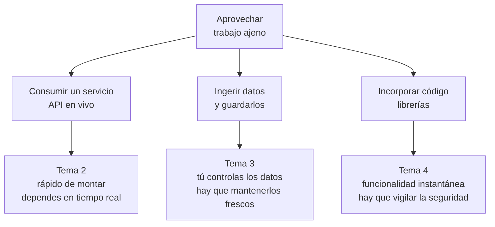

# Qué es una aplicación híbrida

Hasta aquí todo lo que hay en tu aplicación lo has escrito tú, y todos los datos que muestra los ha metido alguien en tu base de datos. Eso, en la industria, es raro.

Lo normal es lo contrario: **una aplicación real se apoya en trabajo ajeno**. Datos que ya existen, servicios que ya funcionan, librerías que ya resuelven el problema. Esta unidad va de hacerlo bien.

## 1. La definición y el ejemplo

Una **aplicación web híbrida** —o *mashup*— es la que combina datos, servicios o funcionalidad de **varias fuentes**, propias y ajenas, para ofrecer algo que ninguna de ellas daba por separado.

Un ejemplo que existe y que entiende todo el mundo: una web que busca pisos de alquiler.

| Pieza | De dónde viene |
|---|---|
| Los anuncios | Base de datos propia |
| El mapa con los pisos | API de mapas (tercero) |
| «A 8 min andando del metro» | API de rutas (tercero) |
| «Barrio con renta media de 24.000 €» | Datos abiertos del INE |
| «Colegios cercanos» | Datos abiertos del ayuntamiento |
| El PDF con la ficha del piso | Librería de terceros |

El valor **no está en ninguna de las piezas**. Está en juntarlas. Nadie más tiene esa combinación, y construir cada pieza desde cero costaría años.

## 2. Por qué reutilizar

El criterio *a)* del RA9 pide reconocer las ventajas. Van con números, que convencen más:

| Si lo haces tú | Si lo reutilizas |
|---|---|
| Geocodificar direcciones: meses de trabajo y datos que caducan | Una llamada HTTP |
| Generar PDF: parser de fuentes, tipografías, saltos de página… | Una dependencia y 20 líneas |
| Datos del padrón de un municipio | Portal de datos abiertos, gratis |
| Autenticación con Google | Un `starter` de OAuth2 |

Y el argumento que remata: **el código que no escribes no tiene errores tuyos, no lo mantienes tú y ya lo han probado miles de personas**.

## 3. Y por qué no siempre

Aquí es donde se separa el aprobado del notable. Reutilizar tiene un precio, y hay que saber decirlo:

**Dependes de alguien.** Si la API de terceros se cae, tu aplicación se cae con ella. Si cambia su formato, se rompe. Si mañana pasa a ser de pago, pagas o reescribes.

**Casos reales que conviene conocer:** Google Maps multiplicó sus precios en 2018 y muchos proyectos migraron a OpenStreetMap en semanas. Twitter cerró su API gratuita en 2023 y fulminó cientos de aplicaciones de un día para otro.

**Las licencias mandan.** Una librería GPL en un producto propietario puede obligarte a liberar tu código. Los datos «abiertos» a veces exigen citar la fuente o prohíben el uso comercial.

**Superficie de ataque.** Cada dependencia es código ajeno ejecutándose con tus permisos. El caso `event-stream` (2018) fue una librería popular de npm cuyo mantenimiento se cedió a un desconocido que le añadió un robo de carteras de criptomonedas.

!!! tip "La pregunta de examen"
    *«¿Usarías la API de X para esto?»* nunca se responde con sí o no a secas. Se espera que menciones: **coste y cuotas, qué pasa si se cae, qué licencia tiene y qué plan B existe**.

## 4. Las tres formas de aprovechar lo ajeno

Conviene distinguirlas porque tienen problemas distintos:



| | Consumir en vivo | Ingerir y guardar | Incorporar código |
|---|---|---|---|
| Ejemplo | Tiempo actual | Censo de comercios del municipio | Generar un PDF |
| Si el tercero cae | Tu web falla | Sigues funcionando | No te afecta |
| Frescura | Máxima | La de tu última carga | — |
| Coste por petición | Sí, suele haberlo | Solo al cargar | No |

La decisión sale casi sola: **si el dato cambia cada minuto, consúmelo; si cambia cada mes, ingiérelo.** Consultar en vivo un censo que se actualiza una vez al año es regalar latencia y cuota.

## 5. Dónde encontrar datos e información ya existente

Para las prácticas y el examen, fuentes reales y gratuitas:

| Fuente | Qué trae |
|---|---|
| [datos.gob.es](https://datos.gob.es) | Catálogo nacional de datos abiertos |
| Portales municipales (Madrid, Barcelona, Zaragoza…) | Comercios, tráfico, bibliotecas, contaminación |
| INE | Población, renta, empleo |
| AEMET OpenData | Predicción y datos históricos |
| OpenStreetMap / Nominatim | Mapas y geocodificación |
| Open Library, Open Food Facts | Libros y productos alimentarios |
| Banco de España, BCE | Tipos de cambio |

!!! warning "Antes de usar una fuente, tres comprobaciones"
    1. **Licencia**: ¿permite uso comercial? ¿obliga a citar?
    2. **Cuota**: ¿cuántas peticiones al día? ¿hace falta clave?
    3. **Estabilidad**: ¿tiene versionado? ¿avisan de los cambios?

    Un proyecto que ignora esto funciona en clase y muere en producción.

## 6. Formatos con los que te vas a encontrar

Todo esto ya lo sabes de la UT3 y la UT6; aquí solo cambia el origen:

- **JSON** — lo habitual en APIs modernas. Jackson, como siempre.
- **CSV** — lo habitual en datos abiertos. Ojo con el separador (`;` en España), la codificación y las cabeceras con acentos.
- **XML** — administración pública y sistemas antiguos.
- **GeoJSON** — datos con coordenadas.
- **Excel** — más frecuente de lo que debería en portales públicos.

!!! danger "El CSV español da guerra"
    Separador `;` en vez de `,`, decimales con coma, codificación `ISO-8859-1` en vez de UTF-8 y a veces un BOM al principio. Si al leer un CSV público te salen `ñ` donde debería haber `ñ`, es la codificación.

    ```java
    Files.lines(ruta, Charset.forName("ISO-8859-1"))
    ```

## 7. Lo que vas a construir

El proyecto de la unidad enriquece tu aplicación con fuentes externas:

1. **Consumir** una API pública en vivo y mostrarla en tu web (tema 2).
2. **Ingerir** un conjunto de datos abiertos a tu propia base de datos, de forma repetible (tema 3).
3. **Incorporar** librerías para exportar a PDF y a Excel, y generar códigos QR (tema 4).
4. **Analizar** los datos combinados y montar un cuadro de mando (tema 5).
5. **Probar** todo eso sin depender de que las APIs de terceros estén levantadas (tema 6).

Y lo importante: al final, **tu aplicación tiene que seguir funcionando aunque todas las fuentes externas estén caídas**. Peor, pero funcionando. Eso es lo que separa una integración profesional de una demo.

## Pruébalo ahora (15 min)

!!! reto "Trabaja tú ahora"
    Este bloque se hace **en clase, en tu equipo**. No se entrega ni puntúa: es la práctica que hace que el examen te salga.

Antes de escribir una línea de Java, **audita una fuente de datos abiertos de verdad**. Es lo primero que se hace en un proyecto híbrido, y casi nadie lo hace.

Elige un conjunto de datos del [portal de datos abiertos del Ayuntamiento de Madrid](https://datos.madrid.es) o de [datos.gob.es], y rellena esta ficha:

| | |
|---|---|
| **Nombre y URL** | |
| **Formato** | CSV · JSON · XML · API |
| **Licencia** | ¿permite uso comercial? ¿exige atribución? |
| **Actualización** | ¿cada cuánto se publica de verdad? Mira la fecha del último fichero |
| **Codificación** | ¿UTF-8? Ábrelo y busca acentos |
| **Registros** | ¿cuántos? |
| **Campos que te sirven** | |
| **Sorpresas** | filas vacías, decimales con coma, fechas en tres formatos… |

Y ahora **descárgalo y míralo de verdad**, sin abrirlo con Excel, que arregla cosas por su cuenta:

```bash
curl -s -o datos.csv "URL_DEL_FICHERO"

file datos.csv                 # ¿qué codificación detecta?
head -3 datos.csv              # cabecera y dos filas
wc -l datos.csv                # cuántas líneas
awk -F';' '{print NF}' datos.csv | sort -u    # ¿todas las filas tienen las mismas columnas?
```

Esa última orden es la que más sorpresas da: si devuelve más de un número, **hay filas con distinto número de columnas** y tu carga va a fallar en la fila 4.000.

---

## Ejercicios (con solución)

### Ejercicio 1 — Define y pon un ejemplo

Define «aplicación híbrida» y pon un ejemplo con al menos tres fuentes.

??? success "Solución"

    Una aplicación híbrida es la que **construye su valor combinando piezas propias con piezas ajenas**: datos de terceros, servicios de terceros y librerías de terceros, unidos por una lógica que es tuya.

    Lo que la hace tuya no son los datos: es **la unión**.

    Ejemplo, un buscador de comercio local:

    | Fuente | Qué aporta | De quién |
    |---|---|---|
    | Censo de locales del Ayuntamiento | nombre, dirección, actividad | ajena, ingerida |
    | API de geocodificación | convertir la dirección en coordenadas | ajena, en vivo |
    | AEMET | si mañana llueve, se recomienda comercio cubierto | ajena, en vivo |
    | Leaflet | pintar el mapa | librería ajena |
    | **Reseñas y favoritos de tus usuarios** | **lo único que es tuyo** | propia |

    Ninguna de las cuatro primeras es tuya, y aun así la aplicación **no existe sin la quinta ni sin la forma en que las juntas**.

### Ejercicio 2 — Ventajas y riesgos

Dos ventajas y dos riesgos de reutilizar código o datos ajenos.

??? success "Solución"

    **Ventajas**

    1. **Tiempo.** Levantar el censo de comercios de un municipio te llevaría meses de trabajo de campo; descargarlo, una tarde.
    2. **Calidad que no puedes igualar.** La predicción de AEMET la respalda una red de estaciones. Tu predicción casera no compite.

    **Riesgos**

    1. **Dependes de que sigan ahí.** La API cambia de versión, sube el precio, cierra. Tu aplicación se queda coja de la noche a la mañana.
    2. **Heredas sus errores y sus licencias.** Si el censo tiene direcciones mal, tu mapa las pinta mal y quien da la cara eres tú. Y si la librería es AGPL, tu código puede quedar obligado a publicarse.

    El tercero, que no se ve venir: **el rendimiento deja de estar en tus manos**. Si la API tarda tres segundos, tu página tarda tres segundos.

### Ejercicio 3 — Consumir o ingerir

¿Cuándo conviene consumir en vivo y cuándo ingerir? Un ejemplo de cada uno.

??? success "Solución"

    | | Consumir en vivo | Ingerir |
    |---|---|---|
    | **Cuándo** | El dato cambia rápido y solo vale si es de ahora | El dato cambia poco y lo consultas mucho |
    | **Ejemplo** | La predicción del tiempo de mañana | El censo de comercios del municipio |
    | **Coste** | Una llamada por consulta | Una descarga periódica |
    | **Si el tercero cae** | Tu función deja de estar disponible | No te enteras |
    | **Puedes** | Poco: lo que te dé su API | Todo: indexar, cruzar, agregar |

    La regla práctica: **si vas a buscar, filtrar, ordenar o cruzar con datos tuyos, ingiere.** Ninguna API ajena te va a dejar hacer un `JOIN` con tu tabla de favoritos.

    Y una tercera vía que se olvida: **ingerir y refrescar en vivo lo que caduque**. El comercio se ingiere; su horario de hoy se consulta.

### Ejercicio 4 — Antes de usar una fuente

¿Qué tres cosas compruebas antes de usar una fuente de datos abiertos?

??? success "Solución"

    1. **La licencia.** «Abierto» no significa «haz lo que quieras». Comprueba si permite uso comercial y si exige citar el origen. Sin fichero de licencia, la respuesta por defecto es **no puedes usarlo**.
    2. **Cuándo se actualiza de verdad.** No lo que diga la ficha, sino la fecha del último fichero publicado. Un censo que dice «mensual» y lleva dos años parado no sirve para un buscador de comercios.
    3. **La forma de los datos.** Codificación, separador, formato de las fechas, si hay filas con distinto número de columnas. Se comprueba descargando y mirando, no leyendo la documentación.

    Una cuarta que evita disgustos: **si hay cuota**, cuántas peticiones al día y qué pasa al pasarse.

### Ejercicio 5 — `ñ`

Un CSV público te muestra `ñ` donde debería poner `ñ`. ¿Qué pasa y cómo se arregla?

??? success "Solución"

    El fichero **está en UTF-8 y lo estás leyendo como ISO-8859-1**, o al revés. La `ñ` en UTF-8 ocupa dos bytes (`C3 B1`); si los interpretas de uno en uno como Latin-1, salen los dos caracteres `Ã` y `±`. Se llama *mojibake*.

    Primero, averigua qué es de verdad:

    ```bash
    file -i datos.csv          # charset=utf-8 o charset=iso-8859-1
    ```

    Y luego léelo con la codificación buena, **siempre explícita**:

    ```java
    try (var lineas = Files.lines(csv, StandardCharsets.UTF_8)) { … }
    ```

    Nunca `Files.lines(csv)` a secas: usa la codificación por defecto del sistema, que en tu Windows y en el servidor Linux **no es la misma**. Funciona en clase y falla al desplegar.

    Si el fichero de verdad viene en Latin-1, no lo conviertas a mano: léelo con `StandardCharsets.ISO_8859_1` y guárdalo ya en UTF-8.

### Ejercicio 6 — La API que se cae

Tu web depende de una API que se cae dos veces al mes. ¿Qué haces?

??? success "Solución"

    Lo primero: **decidir si esa función es esencial**. Si la web es un buscador de comercios y la API es la del tiempo, la web tiene que seguir funcionando sin ella. Ese es el 90 % de la respuesta.

    Y luego, cuatro medidas, de la más barata a la más cara:

    1. **Tiempos de espera.** Sin `readTimeout`, la caída ajena te bloquea los hilos y **tu** web deja de responder. Es lo primero que hay que poner.
    2. **Caché.** Si el dato del tiempo de hace media hora sigue siendo válido, la caída de diez minutos no la nota nadie.
    3. **Valor de reserva.** Que el método devuelva «sin datos meteorológicos» en vez de propagar la excepción a la página.
    4. **Cortacircuitos.** Tras varios fallos seguidos, dejar de llamar durante un rato. Así ni castigas a la API caída ni tus usuarios esperan por nada.

    Y una que no es técnica: **avísalo en la interfaz**. «Datos del tiempo no disponibles» es infinitamente mejor que una casilla vacía sin explicación.
