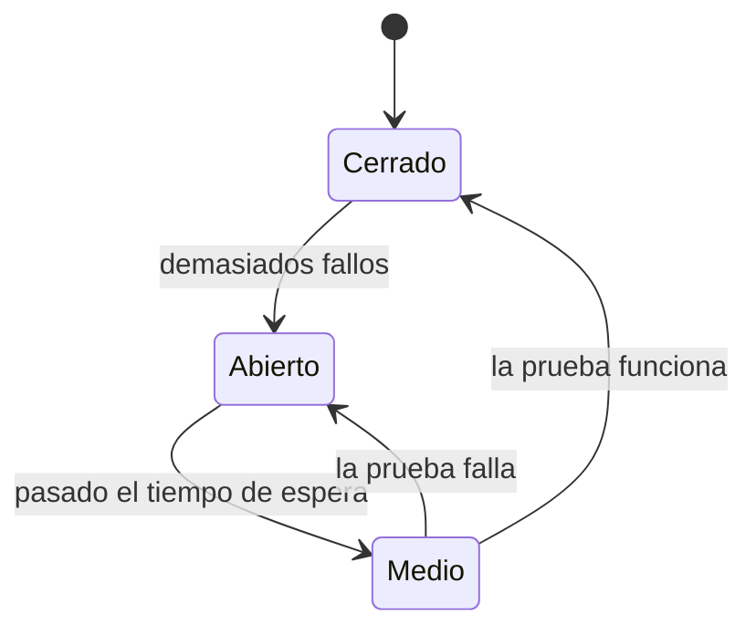

# Consumir servicios de terceros

En la UT6 aprendiste `RestClient` y llamaste a una API. Aquí la diferencia es que **esa API no es tuya**: no la controlas, no sabes cuándo se cae y te cobra por petición.

Todo este tema va de esa diferencia.

## 1. El cliente, bien montado

``` { .java .numerado }
@Configuration
public class ClientesExternos {

    @Bean
    RestClient aemet(@Value("${aemet.url}") String url,
                     @Value("${aemet.clave}") String clave) {
        return RestClient.builder()
            .baseUrl(url)
            .defaultHeader("api_key", clave)
            .requestFactory(fabricaConTiempos())
            .build();
    }

    private ClientHttpRequestFactory fabricaConTiempos() {
        var f = new SimpleClientHttpRequestFactory();
        f.setConnectTimeout(Duration.ofSeconds(3));
        f.setReadTimeout(Duration.ofSeconds(5));
        return f;
    }
}
```

```yaml
aemet:
  url: https://opendata.aemet.es/opendata/api
  clave: ${AEMET_CLAVE}      # ← variable de entorno, NUNCA en el repositorio
```

!!! danger "La clave, fuera del código"
    Una clave en el `application.yml` acaba en Git, y de Git no se borra: aunque hagas un *commit* quitándola, sigue en el historial. GitHub tiene rastreadores automáticos buscando claves en repositorios públicos, y hay historias reales de facturas de miles de euros por una clave de AWS filtrada.

    En el examen, una clave escrita en el código es un fallo grave de seguridad.

!!! warning "Los *timeouts* no son opcionales"
    Sin `readTimeout`, una API que no responde deja tu hilo esperando **para siempre**. Con suficientes usuarios, tu aplicación se queda sin hilos y **se cae entera por culpa de un tercero**.

    Tres segundos para conectar y cinco para leer son valores razonables. Lo que no es razonable es no ponerlos.

## 2. La llamada y el mapeo

``` { .java .numerado }
public record TiempoDto(String municipio, double temperatura, String estado) {}

@Service
public class TiempoServicio {

    private final RestClient aemet;

    public Optional<TiempoDto> deMunicipio(String codigo) {
        try {
            var r = aemet.get()
                .uri("/prediccion/especifica/municipio/diaria/{c}", codigo)
                .retrieve()
                .body(RespuestaAemet.class);
            return Optional.of(convertir(r));
        } catch (RestClientException e) {
            log.warn("AEMET no responde para {}: {}", codigo, e.getMessage());
            return Optional.empty();
        }
    }
}
```

Dos decisiones importantes en esas pocas líneas:

**El DTO es tuyo, no suyo.** Nunca dejes que la estructura JSON de un tercero se filtre a tu dominio. Si mañana AEMET renombra un campo, quieres arreglar **una** clase de conversión, no cincuenta sitios.

**Devuelve `Optional`, no lances la excepción hacia arriba.** El tiempo es un extra: si falla, la página debe cargarse igual, sin el recuadro del tiempo. Que una fuente secundaria tumbe una página entera es un error de diseño.

Y por si el JSON ajeno trae campos que no te interesan —que los traerá—:

```java
@JsonIgnoreProperties(ignoreUnknown = true)
public record RespuestaAemet(String nombre, List<Dia> prediccion) {}
```

Sin eso, el día que añadan un campo nuevo tu aplicación empieza a fallar sin que hayas tocado nada.

## 3. Que un fallo ajeno no sea un fallo tuyo

Tres capas de protección, de menos a más:

### Valor de reserva

```java
public TiempoDto deMunicipioOSinDatos(String codigo) {
    return deMunicipio(codigo).orElse(TiempoDto.sinDatos());
}
```

La página muestra «Información no disponible» en lugar de un error 500. Es lo mínimo.

### Reintento con espera creciente

```java
@Retryable(retryFor = RestClientException.class,
           maxAttempts = 3,
           backoff = @Backoff(delay = 500, multiplier = 2))
public TiempoDto deMunicipio(String codigo) { … }

@Recover
public TiempoDto siFalla(RestClientException e, String codigo) {
    return TiempoDto.sinDatos();
}
```

500 ms, 1 s, 2 s. La espera creciente (*backoff exponencial*) es importante: reintentar tres veces seguidas contra un servidor saturado lo satura más.

!!! danger "No reintentes lo que no es idempotente"
    Un `GET` se puede repetir sin consecuencias. Un `POST` que cobra una tarjeta, **no**: puedes cobrar tres veces.

    Antes de poner `@Retryable`, pregúntate si repetir la operación es seguro. Es la misma idempotencia de la UT1, ahora con dinero de por medio.

### Cortacircuitos

Si una API lleva veinte fallos seguidos, seguir llamándola es tirar tiempo. El patrón *circuit breaker* deja de intentarlo durante un rato y responde directamente con el valor de reserva:

```java
@CircuitBreaker(name = "aemet", fallbackMethod = "siFalla")
public TiempoDto deMunicipio(String codigo) { … }
```



Con **Cerrado** = todo normal, **Abierto** = ni lo intento, **Medio** = dejo pasar una para ver si ya va.

## 4. Caché: menos peticiones, menos factura

Si el dato no cambia cada segundo, guárdalo.

```java
@EnableCaching
@Configuration
public class CacheConfig { }

@Cacheable(value = "tiempo", key = "#codigo")
public TiempoDto deMunicipio(String codigo) { … }
```

```yaml
spring.cache:
  cache-names: tiempo
  caffeine.spec: maximumSize=500,expireAfterWrite=30m
```

Media hora de caché sobre una predicción meteorológica no le quita valor a nadie y puede dividir tus llamadas por cien. Si la API te da 500 peticiones al día y tienes 300 usuarios, la caché es la diferencia entre funcionar y no funcionar.

**Qué caché y cuánto:**

| Dato | Caché razonable |
|---|---|
| Tipo de cambio | 1 hora |
| Predicción del tiempo | 30 min |
| Callejero, geocodificación | Días |
| Censo, padrón | Ingerirlo (tema 3) |
| Saldo de una cuenta | Ninguna |

## 5. Cuotas y buenos modales

Las APIs públicas suelen limitar. Cuando te pasas, responden **429 Too Many Requests**, muchas veces con una cabecera que dice cuándo puedes volver:

```java
catch (HttpClientErrorException.TooManyRequests e) {
    var espera = e.getResponseHeaders().getFirst("Retry-After");
    log.warn("Cuota agotada, reintentar en {} s", espera);
    return TiempoDto.sinDatos();
}
```

Reglas no escritas que conviene respetar, porque si no te bloquean la clave:

- **Identifícate** con una cabecera `User-Agent` que diga quién eres y cómo contactarte.
- **No martillees.** Si necesitas 5.000 registros, pídelos paginando con pausa, no en 5.000 peticiones simultáneas.
- **Respeta el `Retry-After`.**
- **Cachea.** Es lo que más agradecen.

## 6. Componer varias fuentes

Cuando una página necesita tres APIs, llamarlas una detrás de otra suma sus tiempos. Si cada una tarda 400 ms, el usuario espera 1,2 s.

```java
public FichaPiso componer(Long id) {
    var piso = repo.findById(id).orElseThrow();

    var mapa    = CompletableFuture.supplyAsync(() -> mapas.geocodificar(piso.getDireccion()));
    var tiempo  = CompletableFuture.supplyAsync(() -> clima.deMunicipio(piso.getMunicipio()));
    var colegios= CompletableFuture.supplyAsync(() -> centros.cercaDe(piso.getDireccion()));

    CompletableFuture.allOf(mapa, tiempo, colegios).join();
    return new FichaPiso(piso, mapa.join(), tiempo.join(), colegios.join());
}
```

Ahora el usuario espera lo que tarde **la más lenta**, no la suma. Con los hilos virtuales de Java 21+ que viste en la UT2, esto además es baratísimo.

!!! tip "Lo primero, medir"
    Antes de paralelizar, comprueba dónde se va el tiempo. Si una API tarda 900 ms y las otras dos 50 ms, paralelizar ahorra 100 ms: probablemente no compensa la complejidad. Optimizar sin medir es adivinar.

## 7. Registrar lo que pasa

Cuando algo falle —y con APIs ajenas falla— vas a necesitar saber qué se pidió y qué contestaron:

```java
log.info("AEMET {} → {} en {} ms", codigo, respuesta.getStatusCode(), ms);
```

Y lo que **nunca** se escribe en un log: la clave de la API, los tokens, ni datos personales de los usuarios. Es exactamente la lección de la UT1 sobre logs, aplicada.

## Pruébalo ahora (20 min)

!!! reto "Trabaja tú ahora"
    Este bloque se hace **en clase, en tu equipo**. No se entrega ni puntúa: es la práctica que hace que el examen te salga.

Un cliente completo contra una API pública que **no pide clave**, con tiempos de espera, DTO propio, caché y valor de reserva.

``` { .java .numerado title="CambioService.java" }
@Service
public class CambioService {

    private static final Logger log = LoggerFactory.getLogger(CambioService.class);

    private final RestClient cliente;

    public CambioService(RestClient.Builder constructor) {
        var ajustes = new SimpleClientHttpRequestFactory();
        ajustes.setConnectTimeout(Duration.ofSeconds(2));
        ajustes.setReadTimeout(Duration.ofSeconds(3));      // SIN ESTO, te cuelgas

        this.cliente = constructor
                .baseUrl("https://api.frankfurter.dev/v1")
                .requestFactory(ajustes)
                .build();
    }

    /** Lo que TÚ necesitas, no lo que el tercero devuelve. */
    public record Cambio(String moneda, BigDecimal valor, LocalDate fecha) {}

    /** La forma exacta de la respuesta ajena, aislada aquí. */
    private record RespuestaAjena(String base, LocalDate date, Map<String, BigDecimal> rates) {}

    @Cacheable(value = "cambio", key = "#moneda")
    public Optional<Cambio> aEuros(String moneda) {
        try {
            var respuesta = cliente.get()
                    .uri(u -> u.path("/latest").queryParam("symbols", moneda).build())
                    .retrieve()
                    .body(RespuestaAjena.class);

            if (respuesta == null || respuesta.rates().get(moneda) == null) {
                return Optional.empty();
            }
            return Optional.of(new Cambio(moneda,
                                          respuesta.rates().get(moneda),
                                          respuesta.date()));

        } catch (RestClientException e) {
            // Un fallo ajeno NO es una excepción tuya que suba hasta el usuario
            log.warn("Cambio no disponible para {}: {}", moneda, e.getMessage());
            return Optional.empty();
        }
    }
}
```

```yaml title="application.yml"
spring:
  cache:
    cache-names: cambio
    caffeine.spec: maximumSize=50,expireAfterWrite=1h
```

Y ahora **las cuatro pruebas que enseñan de verdad**:

1. Llámalo dos veces seguidas con la misma moneda. La segunda es instantánea: no ha salido a la red.
2. **Baja el `readTimeout` a 1 milisegundo.** El método devuelve `Optional.empty()` y la aplicación sigue viva. Eso es un fallo ajeno bien tratado.
3. **Desconecta la red y llama.** Mismo resultado: vacío y un aviso en el log, no una página de error.
4. **Cambia la URL base a `https://api.frankfurter.dev/NO_EXISTE`.** Comprueba que tampoco revienta.

---

## Ejercicios (con solución)

### Ejercicio 1 — La clave en el repositorio

¿Por qué la clave de la API no puede estar en el `application.yml` del repositorio?

??? success "Solución"

    Porque **Git no olvida**. Aunque la borres mañana, sigue en el historial: `git log -p` la enseña. Y si el repositorio es público, hay robots rastreando GitHub que encuentran claves en minutos.

    Y hay una segunda razón, menos dramática pero más habitual: **la clave cambia por entorno**. La de desarrollo no es la de producción, y una clave en el fichero versionado obliga a editar código para desplegar.

    La forma correcta: una variable de entorno con valor por defecto vacío.

    ```yaml title="application.yml — este SÍ se versiona"
    aemet:
      clave: ${AEMET_CLAVE:}
    ```

    ```bash title=".env — este va en el .gitignore"
    AEMET_CLAVE=eyJhbGciOiJIUzI1...
    ```

    Y si ya la has subido: **no basta con borrarla del fichero**. Hay que darla por comprometida y **revocarla en el proveedor**.

### Ejercicio 2 — Sin `readTimeout`

¿Qué le pasa a tu aplicación si llamas a una API sin `readTimeout` y esa API deja de responder?

??? success "Solución"

    Que **el hilo se queda esperando indefinidamente**. No es que esa petición falle: es que ese hilo no vuelve.

    Y como el servidor tiene un número limitado de hilos —200 por defecto en Tomcat—, con suficientes usuarios entrando a esa página se agotan todos. A partir de ahí **tu aplicación entera deja de responder**, incluidas las páginas que no tienen nada que ver con la API caída.

    Se llama *fallo en cascada*: un tercero se cae y se lleva por delante a quien depende de él.

    La cura son dos líneas:

    ```java
    ajustes.setConnectTimeout(Duration.ofSeconds(2));   // tardar en conectar
    ajustes.setReadTimeout(Duration.ofSeconds(3));      // tardar en contestar
    ```

    **Sin tiempo de espera no hay integración, hay una bomba de relojería.** Es lo primero que se mira al corregir.

### Ejercicio 3 — DTO propio

¿Por qué mapear a un DTO propio en vez de usar la estructura del tercero?

??? success "Solución"

    Para que **el cambio ajeno se pare en un sitio**. Si la API renombra `rates` a `exchangeRates`, con un DTO propio tocas una clase; sin él, tocas el servicio, los controladores y las plantillas.

    Tres razones más:

    - **Te quedas con lo que usas.** La respuesta trae treinta campos y tú necesitas tres. Arrastrar los treinta por toda la aplicación es ruido.
    - **Los tipos son los tuyos.** El tercero manda `"2026-09-06"` y `"1.0954"` como cadenas; tu DTO tiene `LocalDate` y `BigDecimal`, y la conversión ocurre **una vez**, en el borde.
    - **Puedes cambiar de proveedor.** El día que cambies de API, si tu `Cambio` sigue igual, el resto de la aplicación ni se entera.

    Es la misma idea de los DTO de la UT4, aplicada al revés: allí protegías tu modelo de salir; aquí proteges tu aplicación de lo que entra.

### Ejercicio 4 — Reintento con espera creciente

Explícalo y di por qué no vale para cualquier operación.

??? success "Solución"

    Ante un fallo, se reintenta esperando **cada vez más**: 1 s, 2 s, 4 s… en vez de machacar de inmediato.

    ```java
    @Retryable(retryFor = RestClientException.class,
               maxAttempts = 3,
               backoff = @Backoff(delay = 1000, multiplier = 2))
    ```

    La espera creciente importa: si la API está saturada, reintentar al instante y todos a la vez es **echar gasolina al fuego**.

    **No vale para operaciones que no son idempotentes.** Reintentar un GET es inofensivo: si la primera respuesta se perdió, pedirlo otra vez da lo mismo. Reintentar un POST que cobra 20 € puede cobrar 20 € tres veces, porque el fallo pudo ocurrir **después** de que el pago se procesara y antes de que llegara la respuesta.

    | Operación | ¿Reintentable? |
    |---|:-:|
    | GET, HEAD | Sí |
    | PUT, DELETE (por diseño idempotentes) | Sí |
    | POST que crea o cobra | **No**, salvo con clave de idempotencia |

    Tampoco tiene sentido reintentar un **400** o un **404**: no van a cambiar por insistir. Solo se reintentan fallos de red y **5xx**.

### Ejercicio 5 — Cortacircuitos

¿Qué hace y en qué se diferencia de un reintento?

??? success "Solución"

    Un cortacircuitos **cuenta los fallos y, pasado un umbral, deja de llamar** durante un tiempo. Las llamadas siguientes fallan al instante, sin salir a la red.

    Tiene tres estados: **cerrado** (todo pasa), **abierto** (nada pasa, se responde con el valor de reserva) y **entreabierto** (deja pasar alguna para ver si el otro ya se ha recuperado).

    La diferencia con el reintento:

    | | Reintento | Cortacircuitos |
    |---|---|---|
    | Ante un fallo | **Insiste** | **Deja de insistir** |
    | Sirve para | Fallos pasajeros: un paquete perdido | Fallos persistentes: el servicio está caído |
    | Si el otro está caído | Lo empeora, y hace esperar al usuario | Lo protege, y responde al instante |

    **Son complementarios, y el orden importa:** el reintento va por dentro, el cortacircuitos por fuera. Se reintenta un par de veces; si ni así, el cortacircuitos se abre y se deja de molestar.

    La señal de que hace falta: tu aplicación va lenta y el motivo es que cada petición espera tres segundos a un servicio que lleva una hora sin responder.

### Ejercicio 6 — 500 de cuota, 300 usuarios

Tienes 500 peticiones diarias de cuota y 300 usuarios al día. ¿Cómo lo resuelves?

??? success "Solución"

    Parece que sobra, y no: **300 usuarios no son 300 peticiones**. Uno solo que recargue la página seis veces se come el margen, y si cada página pide el tiempo de tres municipios, son 900 peticiones con 300 visitas.

    La solución es **caché**, y la clave es qué se cachea:

    ```java
    @Cacheable(value = "tiempo", key = "#codigoMunicipio")
    ```

    Con la clave puesta en el municipio, cien usuarios preguntando por Madrid gastan **una** petición, no cien. Con media hora de caducidad, un municipio consume 48 peticiones al día como mucho.

    ```yaml
    spring.cache.caffeine.spec: maximumSize=500,expireAfterWrite=30m
    ```

    Y dos medidas más:

    - **Precalentar**: una tarea programada que a las 7:00 pida los diez municipios más consultados. Los usuarios ya se lo encuentran en caché.
    - **Contar lo que gastas**, con un contador de Micrometer. Enterarse de que te has pasado de cuota por los correos de los usuarios llega tarde.

### Ejercicio 7 — Tres APIs de 400 ms

Tres APIs que tardan 400 ms cada una. ¿Cuánto espera el usuario en secuencia y en paralelo?

??? success "Solución"

    **En secuencia: 1.200 ms.** Se suman.

    **En paralelo: unos 400 ms**, lo que tarde la más lenta.

    ```java
    var tiempo   = CompletableFuture.supplyAsync(() -> aemet.deMunicipio(cod));
    var comercio = CompletableFuture.supplyAsync(() -> censo.buscar(cod));
    var cambio   = CompletableFuture.supplyAsync(() -> divisas.aEuros("USD"));

    CompletableFuture.allOf(tiempo, comercio, cambio).join();
    ```

    Solo se puede paralelizar si **las tres son independientes**. Si la segunda necesita el resultado de la primera, no hay nada que hacer.

    Dos avisos:

    - **El tiempo de espera se aplica igual**, y ahora importa más: en paralelo, la más lenta manda sobre las tres.
    - En Java 25 hay **hilos virtuales**, que hacen esto barato de verdad: puedes lanzar cientos sin agotar el grupo de hilos.

    Y la pregunta que va detrás en el examen: **¿y si una de las tres falla?** Con `allOf`, una excepción tumba el conjunto. Cada una debe traer su propio valor de reserva para que las otras dos sigan sirviendo.
