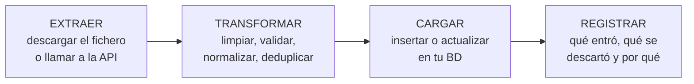

# Crear tu propio repositorio a partir de datos ajenos

El criterio *d)* del RA9 pide *«crear repositorios específicos a partir de información existente en almacenes de información»*. En cristiano: **coger datos de fuera y meterlos en tu base de datos**, con tu estructura y tus reglas.

Es lo que en la industria se llama **ingesta**, o ETL: *Extract, Transform, Load*.

## 1. Por qué ingerir en vez de consultar

Ya lo viste en el tema 1, pero ahora con más detalle:

| | Consultar en vivo | Ingerir |
|---|---|---|
| Latencia | La del tercero | La de tu BD |
| Si el tercero cae | Fallas | Sigues |
| Puedes hacer `JOIN` con tus datos | **No** | **Sí** |
| Puedes indexar y buscar rápido | No | Sí |
| Frescura | Total | La de la última carga |
| Cuota consumida | Por usuario | Por carga |

La tercera fila suele ser la decisiva. Si quieres *«mis comercios ordenados por la renta media de su barrio»*, con la API en vivo tienes que traértelo todo y cruzarlo en memoria. Con los datos ingeridos es una consulta.

## 2. Las tres fases



La cuarta caja no está en las siglas y es la que salva las entregas: **una ingesta sin registro es una caja negra**. Cuando falten 300 registros, sin log no hay forma de saber por qué.

## 3. Extraer

```java
@Component
public class DescargaComercios {

    private final RestClient cliente;

    public Path descargar() throws IOException {
        var destino = Files.createTempFile("comercios", ".csv");
        byte[] datos = cliente.get()
            .uri("/datos/comercios.csv")
            .retrieve()
            .body(byte[].class);
        Files.write(destino, datos);
        log.info("Descargados {} KB", datos.length / 1024);
        return destino;
    }
}
```

Detalles que importan en un fichero público:

- **Guárdalo en disco antes de procesarlo.** Si el proceso falla, puedes reintentar sin volver a descargar 40 MB.
- **No lo cargues entero en memoria** si es grande: `Files.lines` va línea a línea, como en la UT3.
- **Comprueba que ha cambiado** antes de procesarlo. La cabecera `Last-Modified` o un hash del contenido te ahorran trabajo inútil.

## 4. Transformar: donde está el trabajo de verdad

Los datos públicos vienen sucios. Siempre. Este es el aspecto real de un CSV municipal:

```csv
id;nombre;direccion;actividad;telefono;lat;lon
1;PANADERIA LA ESPIGA ;C/ Mayor, 3;PANADERIA;91 123 45 67;40,4168;-3,7038
2;Bar Manolo;Calle Mayor 3;BAR-CAFETERIA;;40.4168;-3.7038
3;;;;;;
2;Bar Manolo;Calle Mayor, 3;BAR;911234567;40,4168;-3,7038
```

Cuatro filas y **cinco problemas distintos**: espacios sobrantes, mayúsculas inconsistentes, decimales con coma, campos vacíos, una fila entera vacía y un duplicado con datos ligeramente distintos.

``` { .java .numerado .annotate title="servicio/TransformadorComercios.java" hl_lines="1 12 22" }
public record ComercioBruto(String id, String nombre, String direccion,
                            String actividad, String telefono, String lat, String lon) {}  // (1)!

@Service
public class TransformadorComercios {

    public ResultadoIngesta transformar(Path csv) throws IOException {
        var validos = new ArrayList<Comercio>();
        var errores = new ArrayList<String>();
        var vistos  = new HashSet<String>();

        try (var lineas = Files.lines(csv, Charset.forName("ISO-8859-1"))) {   // (2)!
            lineas.skip(1)
                  .filter(l -> !l.isBlank())
                  .forEach(l -> procesar(l, validos, errores, vistos));
        }
        log.info("Ingesta: {} válidos, {} descartados", validos.size(), errores.size());  // (3)!
        return new ResultadoIngesta(validos, errores);
    }

    private void procesar(String linea, List<Comercio> ok, List<String> ko, Set<String> vistos) {
        var c = linea.split(";", -1);                 // (4)!
        if (c.length < 7)              { ko.add("Columnas insuficientes: " + linea); return; }
        var nombre = limpiar(c[1]);
        if (nombre.isBlank())          { ko.add("Sin nombre: " + linea); return; }
        if (!vistos.add(claveDe(c)))   { ko.add("Duplicado: " + nombre); return; }  // (5)!

        ok.add(new Comercio(nombre, limpiar(c[2]),
                            Actividad.desde(c[3]),
                            telefono(c[4]),
                            coordenada(c[5]), coordenada(c[6])));
    }

    private String limpiar(String s)      { return s == null ? "" : s.trim().replaceAll("\\s+", " "); }
    private BigDecimal coordenada(String s){ return s.isBlank() ? null : new BigDecimal(s.replace(',', '.')); }  // (6)!
    private String telefono(String s)     { return s.replaceAll("[^0-9]", ""); }
}
```

1.  **Dos modelos, no uno.** `ComercioBruto` es el dato **tal y como viene** del origen: todo `String`, porque el CSV ajeno no garantiza nada. `Comercio` es tu modelo limpio y tipado. Mezclarlos es la causa número uno de que una fila corrupta del origen tumbe la aplicación entera.

2.  **La codificación se declara, no se supone.** Los ficheros abiertos de muchas administraciones españolas siguen viniendo en ISO-8859-1. Si dejas que Java use UTF-8 por defecto, las eñes y las tildes salen como `ñ` y no te enteras hasta que un usuario te lo dice.

3.  **Contar lo descartado es parte del trabajo.** Una ingesta que dice «he cargado 812 comercios» sin decir que ha tirado 40 filas no es una ingesta, es una pérdida de datos silenciosa.

4.  **El `-1` de `split` conserva los campos vacíos del final.** Sin él, `"a;b;;"` devuelve 2 elementos en vez de 4 y el `c.length < 7` de la línea siguiente rechaza filas que estaban bien. Es un fallo que solo aparece con los datos reales, nunca con los de ejemplo.

5.  **`Set.add` devuelve `false` si ya estaba**: comprobar y añadir en una sola operación. Fíjate en que la clave no es el nombre: es `claveDe(c)`, porque el mismo comercio aparece con el nombre escrito de dos formas distintas.

6.  **La coma decimal.** `new BigDecimal("40,41")` lanza `NumberFormatException`; con el punto, funciona. Y `BigDecimal`, no `double`, porque estas coordenadas se comparan y se indexan.

!!! success "El patrón que se repite en toda la UT9"
    **Fuente ajena → modelo bruto → validación y limpieza → modelo propio.** Nunca dejes que el formato de un tercero llegue a tu base de datos: el día que cambien una columna, el destrozo se queda contenido en esta clase.

!!! danger "`split(\";\")` sin el `-1` te come columnas"
    `"a;b;;".split(";")` devuelve **2** elementos, no 4: Java descarta los vacíos del final. Con `split(";", -1)` devuelve los 4.

    Es un fallo que no da error, solo datos mal alineados, y aparece justo cuando los últimos campos vienen vacíos. Cae en el examen.

Y la **normalización**, que es el paso que más valor añade: `PANADERIA`, `Panadería`, `PANADERIA-BOLLERIA` deberían ser la misma categoría. Un `enum` con alias lo resuelve:

```java
public enum Actividad {
    PANADERIA("PANADERIA", "PANADERÍA", "PANADERIA-BOLLERIA"),
    BAR("BAR", "BAR-CAFETERIA", "CAFETERIA"),
    OTROS();

    private final Set<String> alias;
    Actividad(String... a) { this.alias = Set.of(a); }

    public static Actividad desde(String texto) {
        var t = texto.trim().toUpperCase();
        return Arrays.stream(values()).filter(v -> v.alias.contains(t)).findFirst().orElse(OTROS);
    }
}
```

## 5. Cargar sin duplicar: idempotencia

**La regla de oro de una ingesta: ejecutarla dos veces debe dejar la base de datos igual que ejecutarla una vez.**

Si no, cada carga duplica los datos, y tarde o temprano alguien la lanza dos veces.

Se consigue con una **clave natural** —un identificador estable del origen— y una restricción de unicidad en la base de datos:

```java
@Entity
@Table(name = "comercio",
       uniqueConstraints = @UniqueConstraint(columnNames = "codigo_origen"))
public class Comercio {
    @Column(name = "codigo_origen", nullable = false)
    private String codigoOrigen;          // el id del ayuntamiento
    private Instant actualizadoEn;
}
```

```java
@Transactional
public void cargar(List<Comercio> nuevos) {
    for (var n : nuevos) {
        repo.findByCodigoOrigen(n.getCodigoOrigen())
            .ifPresentOrElse(
                existente -> existente.actualizarDesde(n),   // dirty checking, UT5
                ()         -> repo.save(n));
    }
}
```

Eso se llama *upsert*: actualiza si existe, inserta si no.

!!! warning "¿Y lo que desaparece del origen?"
    Si un comercio cierra, deja de estar en el fichero — pero sigue en tu base de datos. Tres estrategias:

    | Estrategia | Cuándo |
    |---|---|
    | Marcar como inactivo lo que no vino en esta carga | **La recomendada**: conservas el histórico |
    | Borrar y recargar todo | Solo si el conjunto es pequeño y no hay relaciones |
    | No hacer nada | Cuando el origen nunca borra (histórico de precios) |

    La primera se implementa con una marca de fecha: los que no se han tocado en esta ejecución pasan a inactivos.

## 6. Automatizar la carga

```java
@Component
public class IngestaProgramada {

    @Scheduled(cron = "0 30 3 * * MON")     // lunes a las 3:30
    public void semanal() {
        try {
            var r = servicio.ingerir();
            log.info("Ingesta OK: {} nuevos, {} actualizados, {} descartados",
                     r.nuevos(), r.actualizados(), r.descartados());
        } catch (Exception e) {
            log.error("Ingesta FALLIDA", e);
            avisos.notificarAdmin("Falló la ingesta semanal: " + e.getMessage());
        }
    }
}
```

Con `@EnableScheduling` en la configuración.

Tres cosas que se olvidan:

- **De madrugada**, cuando no hay usuarios: una ingesta grande da guerra a la base de datos.
- **Que nunca lance la excepción hacia arriba** sin registrarla, o fallará en silencio durante semanas.
- **Que se pueda lanzar a mano**, con un endpoint protegido para administradores. El día que falle no vas a querer esperar al lunes siguiente.

!!! danger "Con varias instancias, se ejecuta varias veces"
    `@Scheduled` corre en **cada** instancia de la aplicación. Con tres réplicas en producción, tres ingestas simultáneas peleándose por las mismas filas.

    Se resuelve con un bloqueo compartido (ShedLock) o con un planificador externo. Basta con que sepas que el problema existe y digas cómo se resuelve.

## 7. Dejar rastro

Guarda cada ejecución en una tabla. Cuesta diez minutos y responde sola a *«¿por qué faltan datos?»*:

```java
@Entity
public class EjecucionIngesta {
    @Id @GeneratedValue private Long id;
    private String fuente;
    private Instant inicio, fin;
    private int leidos, insertados, actualizados, descartados;
    @Enumerated(EnumType.STRING) private Estado estado;   // OK, PARCIAL, FALLIDA
    @Column(length = 2000) private String mensaje;
}
```

Y una página en tu panel de administración que muestre las últimas ejecuciones. Ese pequeño cuadro es lo que convierte un script en un sistema mantenible, y es criterio de rúbrica.

## Pruébalo ahora (20 min)

!!! reto "Trabaja tú ahora"
    Este bloque se hace **en clase, en tu equipo**. No se entrega ni puntúa: es la práctica que hace que el examen te salga.

Una ingesta completa y **idempotente**: se puede ejecutar mil veces y el resultado es el mismo.

``` { .java .numerado title="Comercio.java" }
@Entity
@Table(name = "comercio",
       uniqueConstraints = @UniqueConstraint(columnNames = "codigo_origen"))
public class Comercio {

    @Id @GeneratedValue
    private Long id;

    /** La clave del sistema de origen. Es lo que hace la ingesta idempotente. */
    @Column(name = "codigo_origen", nullable = false)
    private String codigoOrigen;

    private String nombre;
    private String actividad;
    private String direccion;
    private boolean activo = true;
    private LocalDateTime vistoPorUltimaVez;

    // getters y setters
}
```

``` { .java .numerado title="IngestaService.java" }
@Service
public class IngestaService {

    private static final Logger log = LoggerFactory.getLogger(IngestaService.class);

    private final ComercioRepository repositorio;

    @Transactional
    public Resumen ingerir(Path csv) throws IOException {
        var ahora = LocalDateTime.now();
        int nuevos = 0, actualizados = 0, descartados = 0;
        var vistos = new HashSet<String>();

        try (var lineas = Files.lines(csv, StandardCharsets.UTF_8)) {
            for (var linea : lineas.skip(1).filter(l -> !l.isBlank()).toList()) {

                var campo = linea.split(";", -1);        // -1: conserva los vacíos del final
                if (campo.length < 4 || campo[0].isBlank()) { descartados++; continue; }

                var codigo = campo[0].trim();
                if (!vistos.add(codigo)) { descartados++; continue; }   // duplicado en el fichero

                // La clave: buscar por la clave de ORIGEN, no por el id nuestro
                var c = repositorio.findByCodigoOrigen(codigo).orElseGet(Comercio::new);
                boolean esNuevo = c.getId() == null;

                c.setCodigoOrigen(codigo);
                c.setNombre(campo[1].trim());
                c.setActividad(campo[2].trim());
                c.setDireccion(campo[3].trim());
                c.setActivo(true);
                c.setVistoPorUltimaVez(ahora);
                repositorio.save(c);

                if (esNuevo) nuevos++; else actualizados++;
            }
        }

        // Lo que ya no viene en el origen NO se borra: se marca
        int bajas = repositorio.marcarInactivosAnterioresA(ahora);

        var resumen = new Resumen(nuevos, actualizados, descartados, bajas, ahora);
        log.info("Ingesta: {}", resumen);
        return resumen;
    }

    public record Resumen(int nuevos, int actualizados, int descartados,
                          int bajas, LocalDateTime cuando) {}
}
```

```java title="ComercioRepository.java"
Optional<Comercio> findByCodigoOrigen(String codigoOrigen);

@Modifying
@Query("update Comercio c set c.activo = false where c.vistoPorUltimaVez < :corte and c.activo = true")
int marcarInactivosAnterioresA(LocalDateTime corte);
```

Y ahora, **la prueba que define el tema**:

```bash
# Ejecuta la ingesta DOS veces con el mismo fichero
curl -X POST http://localhost:8080/admin/ingesta
curl -X POST http://localhost:8080/admin/ingesta
```

```sql
SELECT COUNT(*) FROM comercio;                    -- el mismo número las dos veces
SELECT codigo_origen, COUNT(*) FROM comercio
  GROUP BY codigo_origen HAVING COUNT(*) > 1;     -- CERO filas
```

La primera ejecución da `nuevos=N, actualizados=0`. La segunda, `nuevos=0, actualizados=N`. **Si la segunda vuelve a decir `nuevos`, tu ingesta duplica.**

Y una prueba más: **quita una fila del CSV y vuelve a ejecutar**. Ese comercio queda con `activo = false`, no desaparece.

---

## Ejercicios (con solución)

### Ejercicio 1 — Las fases

Nombra las tres fases de una ingesta y di qué añadimos nosotros como cuarta.

??? success "Solución"

    **Extraer, Transformar, Cargar** (ETL).

    - **Extraer**: traerse el fichero o llamar a la API. Nada más: aquí no se limpia.
    - **Transformar**: donde está el trabajo. Recortar espacios, unificar mayúsculas, convertir la coma decimal, normalizar fechas, descartar filas inválidas.
    - **Cargar**: escribir en tu base de datos, sin duplicar.

    La cuarta que añadimos: **dejar rastro**. Cada ejecución guarda cuándo fue, cuántos registros entraron, cuántos se actualizaron y cuántos se descartaron.

    No es un extra: es lo único que te deja responder a *«¿por qué hay 4.100 comercios si el fichero traía 4.300?»* sin volver a ejecutar nada. Y es lo primero que se mira cuando un dato aparece mal.

### Ejercicio 2 — Tres razones para ingerir

??? success "Solución"

    1. **Puedes consultar como quieras.** Con los datos en tu base puedes filtrar, ordenar, paginar e —importante— **cruzarlos con los tuyos**. Ninguna API ajena te va a dejar hacer un `JOIN` con tu tabla de favoritos.
    2. **No dependes de que estén vivos.** Si el portal se cae, tu web sigue funcionando con lo ingerido esta mañana.
    3. **Velocidad.** Una consulta a tu PostgreSQL son milisegundos; una llamada a una API ajena, cientos de milisegundos con suerte.

    Y dos más que suman: **no gastas cuota**, y **puedes limpiar los datos una vez** en lugar de arreglar la misma dirección mal escrita en cada petición.

### Ejercicio 3 — `"a;b;;".split(";")`

¿Qué problema tiene y cómo se arregla?

??? success "Solución"

    Devuelve **`["a", "b"]`**, de longitud 2. Java descarta las cadenas vacías del final.

    Es un desastre en una ingesta: si la última columna viene vacía —que pasa constantemente— tu `campo[3]` lanza `ArrayIndexOutOfBoundsException`. Y lo peor es que **falla solo en algunas filas**, así que en clase con tres líneas de prueba no aparece.

    Se arregla con el segundo parámetro:

    ```java
    "a;b;;".split(";", -1)     // ["a", "b", "", ""] — longitud 4
    ```

    Un negativo significa «no descartes nada del final».

    Y aun así, **comprueba la longitud antes de acceder**:

    ```java
    var campo = linea.split(";", -1);
    if (campo.length < 4) { descartados++; continue; }
    ```

    Aviso extra: `split` recibe una **expresión regular**. Si el separador es `|`, hay que escaparlo (`\\|`) o no separa nada. Y si el CSV lleva comas dentro de comillas, `split` no sirve: hace falta un lector de CSV de verdad.

### Ejercicio 4 — Idempotencia

Defínela en una ingesta y explica cómo se consigue.

??? success "Solución"

    **Ejecutarla una vez o cinco produce exactamente el mismo estado en la base de datos.**

    Importa porque las ingestas se repiten: el proceso falló a mitad y lo relanzas, la tarea programada se disparó dos veces, alguien pulsó el botón dos veces.

    Se consigue con una **clave natural del sistema de origen**:

    ```java
    @Column(name = "codigo_origen", nullable = false)
    @UniqueConstraint(columnNames = "codigo_origen")
    ```

    Y la operación deja de ser «insertar» para ser «buscar y actualizar, o crear si no está»:

    ```java
    var c = repositorio.findByCodigoOrigen(codigo).orElseGet(Comercio::new);
    // ... rellenar campos
    repositorio.save(c);
    ```

    Dos avisos:

    - **La restricción de unicidad va en la base de datos**, no solo en el código. Con dos instancias corriendo a la vez, la comprobación en Java no basta.
    - **No vale usar tu `id` autogenerado** como clave. Ese lo pones tú, no viene en el fichero, así que en la segunda ejecución no lo puedes encontrar.

### Ejercicio 5 — El comercio que desaparece

Un comercio desaparece del fichero de origen. ¿Qué haces con el registro que ya tienes?

??? success "Solución"

    **Marcarlo como inactivo, no borrarlo.**

    ```java
    c.setVistoPorUltimaVez(ahora);      // a los que sí vienen
    // y al final:
    repositorio.marcarInactivosAnterioresA(ahora);
    ```

    Tres razones para no borrar:

    1. **Puede haber datos tuyos colgando.** Reseñas, favoritos, un histórico de visitas. Borrar el comercio se los lleva por delante o rompe las claves ajenas.
    2. **Puede volver.** Los ficheros de origen tienen erratas: un comercio que falta esta semana reaparece la siguiente. Si lo borraste, pierdes su historia y le das un `id` nuevo.
    3. **Puede ser un fallo del origen.** Si un día el fichero llega a medias, un borrado te vacía media base de datos en un segundo.

    Por eso mismo conviene una **red de seguridad**: si las bajas de una ejecución superan, digamos, el 20 % del total, **no ejecutar y avisar**. Casi siempre significa que el fichero de origen venía roto.

### Ejercicio 6 — Tres instancias, tres ingestas

Tu aplicación corre en tres instancias y la ingesta se ejecuta tres veces. ¿Por qué y cómo se evita?

??? success "Solución"

    Porque `@Scheduled` es **local a cada proceso**. Cada instancia tiene su propio reloj y su propio planificador, así que a las 3:00 se disparan las tres.

    Si la ingesta es idempotente, el daño es limitado: tres veces el mismo trabajo, y quizá algún error de clave duplicada por la carrera. Si no lo es, te duplica todo.

    Tres formas de evitarlo, de menos a más seria:

    1. **Un perfil**: solo una instancia arranca con `@Profile("planificador")`. Sencillo y frágil: si esa instancia se cae, no hay ingesta.
    2. **Un cerrojo en la base de datos**, que es lo habitual. Con ShedLock:

       ```java
       @Scheduled(cron = "0 0 3 * * *")
       @SchedulerLock(name = "ingestaComercios", lockAtMostFor = "30m")
       public void ingestaNocturna() { … }
       ```

       Las tres se despiertan, una coge el cerrojo y las otras dos se van a dormir.
    3. **Sacarlo de la aplicación**: un trabajo programado del sistema o del orquestador que llame a un endpoint. Así el planificador está donde debe, fuera del servicio.

### Ejercicio 7 — El rastro

¿Qué guardarías de cada ejecución y para qué sirve?

??? success "Solución"

    Una fila por ejecución, en una tabla propia:

    | Campo | Para qué |
    |---|---|
    | `cuando` | Situar en el tiempo cualquier dato raro |
    | `fuente` | Qué fichero o API, con su URL o su nombre |
    | `leidos` | Cuántas filas traía el origen |
    | `nuevos`, `actualizados` | El reparto. En la segunda ejecución, `nuevos` debería ser 0 |
    | `descartados` y **por qué** | Lo más útil: «300 sin código» apunta a un cambio de formato |
    | `bajas` | Las que dejaron de venir. Un salto grande es una alarma |
    | `duracion` | Si sube mes a mes, hay que mirarlo antes de que reviente |
    | `resultado` | Terminada, fallida, o a medias |

    Para qué sirve, en concreto: para responder **«¿por qué faltan comercios?»** mirando una tabla en vez de volver a ejecutar la ingesta a ciegas. Y para detectar que el origen ha cambiado de formato **el día que pasa**, no un mes después cuando alguien se queja.

    Añade un `/actuator/health` propio que se ponga en amarillo si la última ingesta correcta tiene más de 48 horas.
