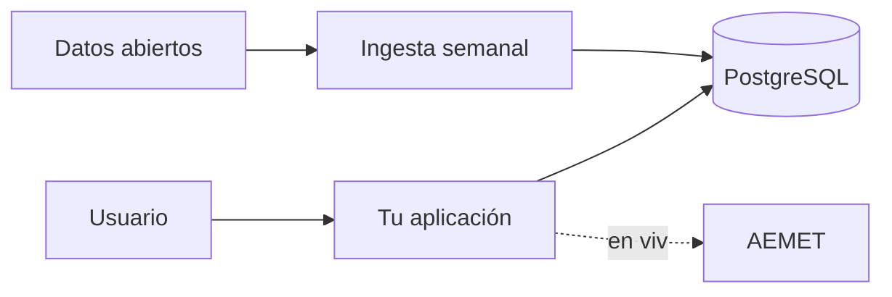

# Probar, documentar y desplegar

El criterio *h)* cierra el RA9 y cierra el módulo: *«se han probado, depurado y documentado las aplicaciones generadas»*.

Aquí hay un problema nuevo que no tenías antes: **la mitad de tu aplicación depende de servidores que no controlas**. Un test que llame de verdad a la API de AEMET es lento, gasta cuota y falla cuando AEMET está de mantenimiento. Eso no es un test.

## 1. Probar sin llamar a nadie: `MockRestServiceServer`

Spring trae un servidor falso que responde lo que tú le digas:

``` { .java .numerado }
@RestClientTest(TiempoServicio.class)
class TiempoServicioTest {

    @Autowired TiempoServicio servicio;
    @Autowired MockRestServiceServer servidor;

    @Test
    void mapeaLaRespuestaAlDtoPropio() {
        servidor.expect(requestTo(containsString("/municipio/28079")))
                .andRespond(withSuccess("""
                    {"nombre":"Madrid","temperatura":22.5,"estado":"Despejado"}
                    """, MediaType.APPLICATION_JSON));

        var t = servicio.deMunicipio("28079").orElseThrow();

        assertThat(t.municipio()).isEqualTo("Madrid");
        assertThat(t.temperatura()).isEqualTo(22.5);
    }

    @Test
    void siLaApiFallaDevuelveVacioYNoRompeLaPagina() {
        servidor.expect(requestTo(anyString()))
                .andRespond(withServerError());

        assertThat(servicio.deMunicipio("28079")).isEmpty();
    }

    @Test
    void siLaApiTardaDemasiadoTampocoRompe() {
        servidor.expect(requestTo(anyString()))
                .andRespond(r -> { throw new SocketTimeoutException(); });

        assertThat(servicio.deMunicipio("28079")).isEmpty();
    }
}
```

Los tres tests cubren lo que hay que cubrir: **el camino bueno, el error y el tiempo agotado**. Los dos últimos son los importantes: demuestran que tu aplicación sobrevive a un tercero caído, que es el criterio central de la unidad.

!!! tip "Guarda respuestas reales como ficheros"
    En `src/test/resources/respuestas/aemet-madrid.json`, una copia literal de lo que devuelve la API de verdad. Así el test comprueba tu mapeo contra el formato real, no contra el que tú te imaginas.

    Cuando el tercero cambie el formato, actualizas el fichero y ves de golpe qué se rompe.

## 2. Probar la ingesta

La ingesta se prueba con un fichero de ejemplo que incluya, a propósito, **todos los problemas del tema 3**:

```
src/test/resources/comercios-sucio.csv
```

``` { .java .numerado }
@Test
void laIngestaLimpiaDeduplicaYCuentaLosDescartes() {
    var r = transformador.transformar(ruta("comercios-sucio.csv"));

    assertThat(r.validos()).hasSize(2);
    assertThat(r.errores()).hasSize(2);          // la fila vacía y el duplicado
    assertThat(r.validos().get(0).getNombre())
        .as("los espacios sobrantes se limpian")
        .isEqualTo("PANADERIA LA ESPIGA");
    assertThat(r.validos().get(0).getLat())
        .as("las coordenadas con coma se convierten")
        .isEqualByComparingTo("40.4168");
}

@Test
void ejecutarDosVecesNoDuplica() {
    servicio.ingerir();
    long tras1 = repo.count();
    servicio.ingerir();
    assertThat(repo.count())
        .as("la ingesta debe ser idempotente")
        .isEqualTo(tras1);
}
```

El segundo test es **el más valioso de la unidad**: la idempotencia no se ve mirando el código, se demuestra ejecutando dos veces.

## 3. Depurar integraciones

Cuando algo falla contra un tercero, la pregunta siempre es la misma: *¿qué le mandé exactamente y qué me contestó?*

```yaml
logging.level:
  org.springframework.web.client.RestClient: DEBUG
```

Y para verlo todo, un interceptor que registre petición y respuesta:

```java
RestClient.builder()
    .requestInterceptor((peticion, cuerpo, ejecucion) -> {
        long t = System.currentTimeMillis();
        var r = ejecucion.execute(peticion, cuerpo);
        log.info("{} {} → {} en {} ms", peticion.getMethod(), peticion.getURI(),
                 r.getStatusCode(), System.currentTimeMillis() - t);
        return r;
    })
```

!!! danger "El log no lleva claves"
    Si registras las cabeceras completas, la clave de la API acaba en el fichero de log, que suele tener permisos más laxos y a veces se manda a un servicio externo. Filtra `Authorization`, `api_key` y similares antes de registrar.

Cuando el problema es de red o de formato, `curl -v` sigue siendo la herramienta más rápida para saber si el fallo es tuyo o suyo.

## 4. Documentar: lo mínimo aceptable

**La API, con OpenAPI** — ya lo tienes de la UT6. Añade los endpoints nuevos.

**El README**, que es lo que se mira primero:

```markdown
# Comercios del municipio

Aplicación que cruza el censo de comercios con datos de renta por barrio.

## Arrancar

    export AEMET_CLAVE=...
    docker compose up -d
    mvn spring-boot:run

## Fuentes de datos

| Fuente | Uso | Licencia | Frecuencia |
|---|---|---|---|
| Censo de comercios (ayuntamiento) | Ingesta semanal | CC BY 4.0 | Lunes 3:30 |
| Renta por barrio (INE) | Ingesta manual | CC BY 4.0 | Anual |
| AEMET OpenData | En vivo, caché 30 min | Requiere clave | — |

## Si una fuente falla

La aplicación funciona sin las fuentes externas: el tiempo no se muestra
y los datos ingeridos siguen sirviéndose desde la base de datos.

## Variables de entorno

| Variable | Obligatoria | Descripción |
|---|:-:|---|
| `AEMET_CLAVE` | no | Sin ella, el recuadro del tiempo no aparece |
| `DB_PASSWORD` | sí | Contraseña de PostgreSQL |
```

Esa tabla de fuentes con su licencia **es criterio de rúbrica**. Es lo que demuestra que has entendido el tema 1 y no solo copiado URLs.

**Un diagrama** de qué habla con qué, aunque sea uno:



## 5. Desplegar

```dockerfile title="Dockerfile"
FROM eclipse-temurin:25-jre-alpine
COPY target/comercios.jar app.jar
EXPOSE 8080
ENTRYPOINT ["java", "-jar", "/app.jar"]
```

```yaml title="compose.yaml — lo mínimo"
services:
  app:
    build: .
    ports: ["8080:8080"]
    environment:
      SPRING_PROFILES_ACTIVE: prod
      DB_PASSWORD: ${DB_PASSWORD}
      AEMET_CLAVE: ${AEMET_CLAVE}
    depends_on:
      db: { condition: service_healthy }
  db:
    image: postgres:17-alpine
    environment:
      POSTGRES_PASSWORD: ${DB_PASSWORD}
    volumes: ["datos:/var/lib/postgresql/data"]
    healthcheck:
      test: ["CMD-SHELL", "pg_isready -U postgres"]
      interval: 5s
      retries: 10
volumes: { datos: }
```

!!! danger "`depends_on` a secas no espera a que la base de datos esté lista"
    Sin `condition: service_healthy`, Docker arranca el contenedor de la base de datos y **acto seguido** el de la aplicación. PostgreSQL tarda unos segundos en aceptar conexiones, así que la aplicación intenta conectarse, falla y se cae.

    Es el fallo número uno con Compose, y el mensaje (`Connection refused`) no dice nada de esto. La pareja `healthcheck` + `condition: service_healthy` lo resuelve.

### Las cuatro bases de datos del segundo trimestre

Cada una está por un motivo distinto. No es coleccionismo: son las cuatro familias que te vas a encontrar.

| | Para qué | Cuándo la eliges |
|---|---|---|
| **PostgreSQL** | La principal del curso | Datos relacionados, transacciones, consultas complejas |
| **MariaDB** | La más extendida en la empresa pequeña | Lo mismo, y porque es la que hay en el hosting |
| **MongoDB** | Documentos sin esquema fijo | Lo que llega de fuera con forma cambiante |
| **Redis** | Caché en memoria | Guardar lo que cuesta calcular, y las sesiones |

```yaml title="compose.yaml — el entorno completo del 2.º trimestre"
name: dwes

services:

  # ── La aplicación ───────────────────────────────────────────────
  app:
    build: .
    ports: ["8080:8080"]
    env_file: [.env]
    environment:
      SPRING_PROFILES_ACTIVE: docker
    depends_on:
      postgres: { condition: service_healthy }
      redis:    { condition: service_healthy }

  # ── PostgreSQL: la base de datos principal ─────────────────────
  postgres:
    image: postgres:17-alpine
    environment:
      POSTGRES_DB: comercios
      POSTGRES_USER: dwes
      POSTGRES_PASSWORD: ${DB_PASSWORD}
    ports: ["5432:5432"]
    volumes: ["pg:/var/lib/postgresql/data"]
    healthcheck:
      test: ["CMD-SHELL", "pg_isready -U dwes -d comercios"]
      interval: 5s
      retries: 10

  # ── MariaDB: para comparar dialectos ───────────────────────────
  mariadb:
    image: mariadb:11
    environment:
      MARIADB_DATABASE: comercios
      MARIADB_USER: dwes
      MARIADB_PASSWORD: ${DB_PASSWORD}
      MARIADB_ROOT_PASSWORD: ${DB_PASSWORD}
    ports: ["3306:3306"]
    volumes: ["maria:/var/lib/mysql"]
    healthcheck:
      test: ["CMD", "healthcheck.sh", "--connect", "--innodb_initialized"]
      interval: 5s
      retries: 10

  # ── MongoDB: documentos de forma variable ──────────────────────
  mongo:
    image: mongo:8
    environment:
      MONGO_INITDB_ROOT_USERNAME: dwes
      MONGO_INITDB_ROOT_PASSWORD: ${DB_PASSWORD}
    ports: ["27017:27017"]
    volumes: ["mongo:/data/db"]
    healthcheck:
      test: ["CMD", "mongosh", "--quiet", "--eval", "db.adminCommand('ping')"]
      interval: 5s
      retries: 10

  # ── Redis: caché ───────────────────────────────────────────────
  redis:
    image: redis:7-alpine
    command: ["redis-server", "--appendonly", "yes", "--maxmemory", "256mb",
              "--maxmemory-policy", "allkeys-lru"]
    ports: ["6379:6379"]
    volumes: ["redis:/data"]
    healthcheck:
      test: ["CMD", "redis-cli", "ping"]
      interval: 5s
      retries: 10

volumes:
  pg: {}
  maria: {}
  mongo: {}
  redis: {}
```

```bash title=".env — al .gitignore, nunca al repositorio"
DB_PASSWORD=una_clave_larga_y_solo_para_desarrollo
AEMET_CLAVE=...
```

**Las órdenes que hay que saber:**

``` { .bash .numerado }
docker compose up -d                  # levantar todo en segundo plano
docker compose ps                     # qué está corriendo y su salud
docker compose logs -f app            # seguir el log de un servicio
docker compose exec postgres psql -U dwes comercios   # una consola dentro
docker compose restart app            # reiniciar solo uno
docker compose down                   # parar y borrar contenedores
docker compose down -v                # ...Y BORRAR LOS DATOS. Cuidado
docker compose up -d --build app      # reconstruir la imagen tras tocar código
docker compose stats                  # cuánta memoria y CPU gasta cada uno
```

!!! danger "`down -v` borra los volúmenes"
    Sin la `-v`, los datos sobreviven y al volver a levantar están ahí. **Con `-v` desaparecen.** Es la orden para empezar de cero, y también la forma más rápida de perder el trabajo de una tarde.

### Redis como caché: dos líneas de cambio

Lo bueno de la abstracción de caché de Spring es que **el código no cambia**. Los `@Cacheable` que escribiste en el tema 2 siguen igual: solo cambia quién guarda.

```xml title="pom.xml"
<dependency>
    <groupId>org.springframework.boot</groupId>
    <artifactId>spring-boot-starter-data-redis</artifactId>
</dependency>
```

```yaml title="application-docker.yml"
spring:
  cache:
    type: redis
  data:
    redis:
      host: redis
      port: 6379
```

Y con eso, el mismo método de antes:

```java
@Cacheable(value = "tiempo", key = "#codigo")
public TiempoDto deMunicipio(String codigo) { … }
```

pasa a guardar en Redis en vez de en la memoria del proceso. **La diferencia importa cuando hay más de una instancia**: con caché en memoria cada una tiene la suya y llamas a la API tres veces; con Redis, la caché es compartida.

Se comprueba desde dentro del contenedor:

```bash
docker compose exec redis redis-cli
> KEYS *              # las claves que ha ido guardando Spring
> TTL "tiempo::28079" # cuánto le queda de vida
> GET "tiempo::28079"
```

!!! tip "Caducidad: ponla siempre"
    ```yaml
    spring.cache.redis.time-to-live: 30m
    ```

    Sin caducidad, una entrada mal metida se queda para siempre y no hay manera de saber por qué la aplicación devuelve datos viejos. La política `allkeys-lru` del `compose.yaml` es la red de seguridad: cuando Redis llegue a 256 MB, tira lo menos usado.

### Un vistazo a MongoDB, y cuándo tiene sentido

```xml
<dependency>
    <groupId>org.springframework.boot</groupId>
    <artifactId>spring-boot-starter-data-mongodb</artifactId>
</dependency>
```

```java
@Document(collection = "respuestas_crudas")
public record RespuestaCruda(@Id String id,
                             String fuente,
                             LocalDateTime cuando,
                             Map<String, Object> contenido) {}

public interface RespuestaRepo extends MongoRepository<RespuestaCruda, String> {
    List<RespuestaCruda> findByFuenteOrderByCuandoDesc(String fuente);
}
```

**El caso en el que gana de verdad, y es el de esta unidad:** guardar la respuesta ajena **tal cual llegó**, antes de transformarla. Cada API tiene su forma, cambian sin avisar, y no quieres una tabla con cuarenta columnas que se queden a `NULL`.

Con eso puedes **reprocesar sin volver a llamar** a la API el día que descubras que estabas interpretando mal un campo.

!!! warning "MongoDB no sustituye a PostgreSQL"
    El error clásico es meter en Mongo lo que son datos relacionados. Tus comercios, barrios, reseñas y usuarios tienen relaciones, restricciones e integridad referencial: eso es PostgreSQL.

    En Mongo va lo que **no tiene forma fija**: respuestas ajenas sin procesar, registros de eventos, documentos de importación. Cada una a lo suyo.

### Y lo innovador: Testcontainers

Aquí está la pieza que cierra el círculo con la corrección automática de los exámenes.

**El problema:** tus tests usan H2 en memoria, pero producción es PostgreSQL. H2 no tiene `date_trunc`, ni `PERCENTILE_CONT`, ni el mismo comportamiento con las mayúsculas. Todas las consultas de analítica del tema 5 **pasan los tests y fallan al desplegar**.

**La solución:** que el test levante un PostgreSQL de verdad, en Docker, y lo tire al terminar.

```xml title="pom.xml"
<dependency>
    <groupId>org.springframework.boot</groupId>
    <artifactId>spring-boot-testcontainers</artifactId>
    <scope>test</scope>
</dependency>
<dependency>
    <groupId>org.testcontainers</groupId>
    <artifactId>postgresql</artifactId>
    <scope>test</scope>
</dependency>
```

``` { .java .numerado title="AnaliticaIT.java" }
@SpringBootTest
@Testcontainers
class AnaliticaIT {

    @Container
    @ServiceConnection                      // Spring Boot 3.1+: se configura solo
    static PostgreSQLContainer<?> postgres =
            new PostgreSQLContainer<>("postgres:17-alpine");

    @Autowired ComercioRepository repositorio;

    @Test
    @DisplayName("La consulta de evolución mensual funciona en PostgreSQL de verdad")
    void evolucionMensual() {
        repositorio.saveAll(List.of(
            comercio("A", LocalDate.of(2026, 1, 15)),
            comercio("B", LocalDate.of(2026, 1, 20)),
            comercio("C", LocalDate.of(2026, 3, 2))));

        var filas = repositorio.altasPorMes();

        assertThat(filas).hasSize(2);
        assertThat(filas.get(0).altas()).isEqualTo(2);
    }
}
```

**`@ServiceConnection` es la clave**: Spring Boot lee el contenedor y configura la URL, el usuario y la contraseña solo. No hay que escribir ni una propiedad.

Lo mismo vale para Redis y para Mongo:

```java
@Container @ServiceConnection
static GenericContainer<?> redis = new GenericContainer<>("redis:7-alpine")
        .withExposedPorts(6379);

@Container @ServiceConnection
static MongoDBContainer mongo = new MongoDBContainer("mongo:8");
```

!!! tip "Por qué esto es lo más útil que vas a aprender de despliegue"
    Deja de existir la frase **«en mi máquina funciona»**. El test arranca la misma versión de la misma base de datos que producción, en el portátil de cualquiera y en la máquina de integración continua.

    Y para el módulo tiene un efecto directo: **las consultas de la UT5 y las de analítica de esta unidad se pueden corregir automáticamente** con la base de datos real, no con un sucedáneo.

    Lo único que hace falta es que Docker esté arrancado. Si no lo está, el test falla con un mensaje claro.

Es el Docker que viste en la UT1 y el PostgreSQL de la UT5, ahora con todo dentro.

**Comprobaciones de salud**, para que quien opere la aplicación sepa si está viva:

```xml title="pom.xml"
<dependency>
    <groupId>org.springframework.boot</groupId>
    <artifactId>spring-boot-starter-actuator</artifactId>
</dependency>
```

```java
@Component
public class SaludAemet implements HealthIndicator {
    @Override public Health health() {
        return servicio.disponible()
            ? Health.up().build()
            : Health.status("DEGRADADO").withDetail("aemet", "sin respuesta").build();
    }
}
```

!!! tip "«Degradado» no es «caído»"
    Que AEMET no responda **no debe** poner tu aplicación en rojo: sigue sirviendo el 95 % de su funcionalidad. Distinguir *caído* de *degradado* es una señal de madurez, y es exactamente la idea que cierra la unidad.

## 6. La lista antes de entregar

- [ ] `mvn test` en verde, **sin conexión a internet**. Si algún test necesita red, no es un test.
- [ ] Ninguna clave en el código ni en el `application.yml` versionado.
- [ ] `.env` y `application-local.yml` en el `.gitignore`.
- [ ] La aplicación arranca y se navega **con todas las fuentes externas apagadas**.
- [ ] La ingesta ejecutada dos veces no duplica.
- [ ] `mvn dependency-check:check` sin vulnerabilidades críticas.
- [ ] README con la tabla de fuentes, licencias y variables de entorno.
- [ ] Diagrama de integraciones.
- [ ] `docker compose up` levanta todo desde cero.

## Pruébalo ahora (25 min)

!!! reto "Trabaja tú ahora"
    Este bloque se hace **en clase, en tu equipo**. No se entrega ni puntúa: es la práctica que hace que el examen te salga.

**Levanta el entorno entero** con el `compose.yaml` de arriba y comprueba las cuatro piezas.

``` { .bash .numerado }
# 1. Todo arriba, y esperar a que estén sanos
docker compose up -d
docker compose ps                      # la columna STATUS debe decir (healthy)

# 2. PostgreSQL: entrar y mirar
docker compose exec postgres psql -U dwes comercios -c "\dt"

# 3. MariaDB: lo mismo, con otro dialecto
docker compose exec mariadb mariadb -u dwes -p comercios -e "SHOW TABLES;"

# 4. MongoDB
docker compose exec mongo mongosh -u dwes -p --eval "show dbs"

# 5. Redis: ver la caché llenarse
docker compose exec redis redis-cli
> KEYS *
```

Y ahora **las cuatro pruebas que enseñan de verdad**:

1. **Llama dos veces al endpoint que usa `@Cacheable`** y mira `KEYS *` en Redis. La clave aparece tras la primera llamada; la segunda no sale a la red.
2. **`docker compose restart app`.** La caché sigue ahí: está en Redis, no en la memoria del proceso. Con caché local se habría perdido.
3. **Quita `condition: service_healthy` del `depends_on`**, haz `docker compose down` y `up`. La aplicación se cae al arrancar con `Connection refused`. Devuélvelo.
4. **`docker compose down` y `up` otra vez.** Los datos siguen: están en el volumen. Ahora prueba `docker compose down -v` y verás que no.

---

## Ejercicios (con solución)

### Ejercicio 1 — Tests que llaman a APIs de verdad

¿Por qué un test no debe llamar de verdad a una API externa? Nombra tres razones.

??? success "Solución"

    1. **Deja de ser repetible.** Si la API cambia sus datos, tu test que esperaba «Madrid, 22 grados» se pone rojo sin que hayas tocado nada. Y un test que falla por motivos ajenos deja de mirarse.
    2. **No funciona sin conexión**, ni en el aula con la red caída, ni en la máquina de integración continua sin salida a internet. El criterio del módulo es tajante: **si un test necesita red, no es un test**.
    3. **Gasta cuota y es lento.** Cien ejecuciones al día son cien llamadas, y cada una añade cientos de milisegundos a una suite que debería ir en segundos.

    Una cuarta: **no puedes probar los fallos**. ¿Cómo pruebas qué pasa cuando la API devuelve 503, si la API funciona? Con un doble, ese caso se provoca en una línea.

    ```java
    servidor.expect(requestTo("/prediccion/28079"))
            .andRespond(withServerError());
    ```

### Ejercicio 2 — Los tres escenarios

¿Qué tres escenarios hay que probar de una integración?

??? success "Solución"

    1. **Que va bien.** La API responde lo esperado y el mapeo a tu DTO es correcto. Es el que todo el mundo escribe.
    2. **Que falla.** 500, 404, tiempo de espera agotado, conexión rechazada. Lo que se comprueba aquí es que **tu aplicación no se cae**: devuelve el valor de reserva y deja un aviso en el log.
    3. **Que responde raro.** Es el que nadie escribe y el que más disgustos da: JSON con un campo que ahora es `null`, una fecha en otro formato, una lista vacía, o directamente HTML porque la API está en mantenimiento.

    ```java
    servidor.expect(requestTo("/prediccion/28079"))
            .andRespond(withSuccess("{\"rates\": null}", MediaType.APPLICATION_JSON));

    assertThat(servicio.deMunicipio("28079")).isEmpty();   // no revienta
    ```

    Y un cuarto que suma: **que la caché funciona**. Dos llamadas seguidas y `servidor.verify()` comprobando que solo salió una petición.

### Ejercicio 3 — Demostrar la idempotencia

¿Cómo se demuestra que una ingesta es idempotente?

??? success "Solución"

    **Ejecutándola dos veces y comprobando que el estado no cambia.** No es una cuestión de opinión: es un test.

    ```java
    @Test
    @DisplayName("Ejecutar la ingesta dos veces no duplica nada")
    void ingestaIdempotente() {
        var primera = servicio.ingerir(FICHERO);
        var segunda = servicio.ingerir(FICHERO);

        assertThat(primera.nuevos()).isEqualTo(4);
        assertThat(segunda.nuevos()).isZero();                  // la clave
        assertThat(segunda.actualizados()).isEqualTo(4);
        assertThat(repositorio.count()).isEqualTo(4);           // y no ha crecido
    }
    ```

    Las tres comprobaciones tienen que estar las tres:

    - **`segunda.nuevos() == 0`**: no ha insertado.
    - **`count()` igual**: la tabla no ha crecido.
    - Y a poder ser, que **el contenido** sea el mismo: si la segunda pasada machaca campos que la primera había calculado, tampoco es idempotente aunque el número de filas cuadre.

    Con Testcontainers esto se prueba **contra PostgreSQL de verdad**, que es donde la restricción de unicidad existe. Con H2 podrías tener un falso verde.

### Ejercicio 4 — Lo que no va en los logs

¿Qué no debe aparecer nunca en los logs de una integración?

??? success "Solución"

    **Claves y credenciales**, lo primero. Y es más fácil de lo que parece meterlas sin querer:

    ```java
    log.debug("Llamando a {}", uri);     // si la clave va en la query, la acabas de registrar
    ```

    Los logs se guardan, se copian, se mandan por correo cuando algo falla y a veces se suben a un servicio ajeno. Una clave ahí es una clave filtrada.

    Tampoco:

    - **Datos personales.** DNI, correos, direcciones, teléfonos. El registro también está sujeto a protección de datos.
    - **La respuesta completa** de la API en `info`. Ocupa muchísimo y suele traer datos personales dentro.
    - **Trazas de excepción por cada fallo esperado.** Si la API cae, no necesitas 500 trazas idénticas: necesitas un aviso resumido.

    Lo que **sí** debe aparecer: qué fuente, qué operación, cuánto tardó, el código de respuesta y un identificador de correlación. Suficiente para diagnosticar, sin nada sensible.

    ```java
    log.warn("AEMET no disponible para municipio={} tras {} ms: {}",
             codigo, duracion, e.getMessage());
    ```

### Ejercicio 5 — Las fuentes en el README

¿Qué información sobre las fuentes de datos tiene que llevar el README y por qué?

??? success "Solución"

    Una tabla con cinco columnas:

    | Fuente | URL | Licencia | Actualización | Qué pasa si falla |
    |---|---|---|---|---|
    | Censo de locales | datos.madrid.es/… | CC BY 4.0 | mensual | Se usa lo último ingerido |
    | AEMET OpenData | opendata.aemet.es | uso con atribución | en vivo | Se oculta el bloque del tiempo |

    Por qué cada una:

    - **La URL**, para que quien continúe el proyecto no tenga que buscarla.
    - **La licencia**, porque casi todas obligan a **citar el origen** en la interfaz. Si no está apuntada, nadie lo hace y estás incumpliendo.
    - **La actualización**, porque explica por qué un dato es de hace tres semanas y evita que alguien lo tome por un fallo.
    - **Qué pasa si falla**, porque es lo primero que se pregunta quien recibe un aviso a las tres de la mañana.

    Y además: **las variables de entorno necesarias**, con un `.env.example` sin valores reales. Sin eso, nadie más puede arrancar el proyecto.

### Ejercicio 6 — Caído y degradado

Diferencia, con un ejemplo de tu proyecto.

??? success "Solución"

    - **Caído**: no puede prestar su servicio. Ejemplo: PostgreSQL no responde. Sin base de datos no hay comercios que enseñar, así que la aplicación no sirve para nada.
    - **Degradado**: funciona, pero con menos. Ejemplo: AEMET no responde. El buscador de comercios sigue funcionando entero; solo falta el recuadro del tiempo.

    La distinción importa porque **decide a quién se despierta de madrugada**. Caído es una urgencia; degradado se mira por la mañana.

    En Actuator se refleja así:

    ```java
    @Component
    public class SaludAemet implements HealthIndicator {
        @Override public Health health() {
            return servicio.disponible()
                ? Health.up().build()
                : Health.status("DEGRADADO")
                        .withDetail("aemet", "sin respuesta desde " + ultimoIntento)
                        .build();
        }
    }
    ```

    ```yaml
    management.endpoint.health.status.order: DOWN,OUT_OF_SERVICE,DEGRADADO,UP
    management.endpoint.health.show-details: when-authorized
    ```

    **Un tercero que se cae no debe poner tu aplicación en rojo.** Si lo hace, tu monitorización se llena de falsas alarmas y en un mes nadie hace caso a las alertas.

### Ejercicio 7 — «Fallan porque la API está caída»

Un compañero dice que sus tests fallan «porque la API de terceros está caída». ¿Qué le dirías?

??? success "Solución"

    Que el problema no es la API: **es que sus tests llaman a la API**.

    Un test unitario tiene que dar el mismo resultado con la red desenchufada. Si el suyo depende de que un servidor ajeno esté vivo, no está probando su código: está comprobando el estado de internet.

    La prueba, en una orden:

    ```bash
    # Desconecta la red y ejecuta
    mvn test
    ```

    Si algo se pone rojo, ahí está la lista de tests que hay que arreglar.

    Cómo se arregla:

    ```java
    @RestClientTest(CambioService.class)
    class CambioServiceTest {

        @Autowired MockRestServiceServer servidor;
        @Autowired CambioService servicio;

        @Test
        void mapeaLaRespuesta() {
            var json = "{\"base\":\"EUR\",\"date\":\"2026-09-06\","
                     + "\"rates\":{\"USD\":1.0954}}";

            servidor.expect(requestTo("/v1/latest?symbols=USD"))
                    .andRespond(withSuccess(json, MediaType.APPLICATION_JSON));

            assertThat(servicio.aEuros("USD"))
                    .get().extracting(Cambio::valor)
                    .isEqualTo(new BigDecimal("1.0954"));
        }
    }
    ```

    Y si de verdad quiere probar contra la API real, eso es un **test de integración aparte**, con otro nombre (`*IT.java`), que se ejecuta a mano y **no forma parte de `mvn test`**. Nunca puede bloquear una entrega.
